<div dir="rtl" align="center">

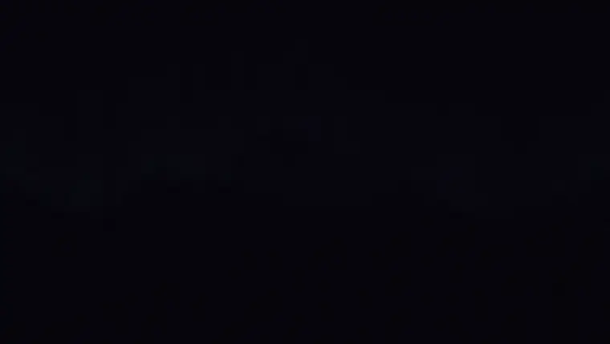

# Cinewright (سینه‌رایت)

**ایجنت کدنویس شما حالا می‌تواند فیلم بسازد.**

یک «اسکیل» متن‌باز برای Codex، Claude Code و هم‌قطارانشان. هر فریم یک صفحهٔ WebGL/Canvas قطعی است و هر صدا با کد ساخته می‌شود — بدون ویدیوی استوک، بدون مدل ویدیوساز، بدون ابر. پرامپت یکسان، ایجنت یکسان: تفاوت فقط اسکیل است. فارسی و راست‌به‌چپ هم درجه‌یک پشتیبانی می‌شود.

[](https://github.com/msmahdinejad/cinewright/actions/workflows/ci.yml)
[](LICENSE)

[**وب‌سایت (فیلم‌ها با صدا)**](https://msmahdinejad.github.io/cinewright/) · [شروع سریع](docs/getting-started.md) · [اطلس تکنیک‌ها](docs/atlas.md) · [نمونه‌پرامپت‌ها](docs/prompts.md) · [بنچمارک](docs/benchmark.md) · [English](README.md)

</div>

<div dir="rtl">

> **نام قبلی: `pure-code-video`.** در نسخهٔ ۲٫۱ به «سینه‌رایت (Cinewright)» تغییر نام داد. برای ارتقا نصب‌کننده را دوباره اجرا کنید؛ نسخهٔ قدیمی را خودش پاک می‌کند. پرامپت `$cinewright` است.

</div>

---

<div dir="rtl">

## اثبات: پرامپت یکسان، ایجنت یکسان — با اسکیل و بدون اسکیل

همین درخواست را در یک پوشهٔ تمیز به هر ایجنت دادیم؛ تنها تفاوت اسکیل است. Codex بدون نظارت و با ریزنینگ **xhigh** اجرا شد؛ هر ایجنت فقط با *خودش* مقایسه می‌شود، نه با ایجنت دیگر. اول کارهایی که بیشتر از همه خواسته می‌شود — موشن‌گرافی ساده، بدون جلوه‌های سه‌بعدی — بعد شوریل رزومه:

</div>

<!-- FA-PROOF:START -->
<div dir="rtl">

**معرفی یک آدم**

</div>

```text
$cinewright Make a 15-second motion graphics video that introduces a person: Maya Chen, a senior product designer from Toronto (invent the details). Show her name and role, three skills, three numbers (years of experience, projects shipped, awards) and a short quote, and end on her handle @mayachen. Clean, modern, energetic — the kind of intro a personal brand would open a talk or a portfolio with. Original music and sound design. Go all out.
```

<table dir="ltr">
<tr><th width="50%">Codex · gpt-6-astra · xhigh — بدون اسکیل</th><th width="50%">با Cinewright</th></tr>
<tr><td align="center">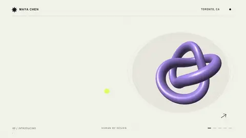</td><td align="center">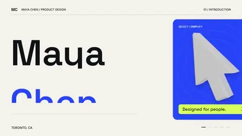</td></tr>
</table>

<div dir="rtl">

<sub>Codex · gpt-6-astra · xhigh: پُری قاب ۱۴٪ ← ۵۰٪ · زمان تقریباً ساکن ۵۷٪ ← ۰٪ · ۲٫۸× توکن · هر خانه یک اجرا</sub>

</div>

<div dir="rtl">

**پرومو عمودی شبکه‌های اجتماعی**

</div>

```text
$cinewright Make a 12-second vertical (9:16) social-media promo for a fictional coffee shop called "Brew & Co." announcing three autumn drinks with prices — Maple Latte €4.50, Spiced Cold Brew €4.00, Pumpkin Mocha €4.80 — and a call to action: "Open daily 7–19 · Main Street". Bold type, flat shapes and simple icon drawings (cups, leaves, beans), a beat-synced edit, punchy sound. Go all out.
```

<table dir="ltr">
<tr><th width="50%">Codex · gpt-6-astra · xhigh — بدون اسکیل</th><th width="50%">با Cinewright</th></tr>
<tr><td align="center">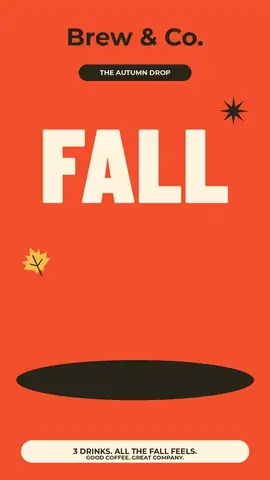</td><td align="center"></td></tr>
</table>

<div dir="rtl">

<sub>Codex · gpt-6-astra · xhigh: پُری قاب ۳۶٪ ← ۳۷٪ · زمان تقریباً ساکن ۴۱٪ ← ۰٪ · ۳٫۶× توکن · هر خانه یک اجرا</sub>

</div>

<div dir="rtl">

**اینترو کانال**

</div>

```text
$cinewright Make an 8-second YouTube channel intro for a fictional tech-review channel called "Pixel Pulse": a logo mark that builds itself, the name, a one-line tagline you write, punchy transitions and sound design (a hit, whooshes, a short musical sting). Bold, bright, memorable. Go all out.
```

<table dir="ltr">
<tr><th width="50%">Codex · gpt-6-astra · xhigh — بدون اسکیل</th><th width="50%">با Cinewright</th></tr>
<tr><td align="center">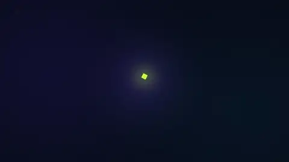</td><td align="center">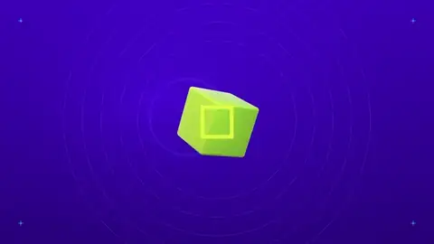</td></tr>
</table>

<div dir="rtl">

<sub>Codex · gpt-6-astra · xhigh: پُری قاب ۹٪ ← ۳۱٪ · زمان تقریباً ساکن ۵۷٪ ← ۱۴٪ · ۵٫۱× توکن · هر خانه یک اجرا</sub>

</div>

<div dir="rtl">

**اینفوگرافیک متحرک**

</div>

```text
$cinewright Make a 20-second animated infographic explainer titled "Why sleep matters" with three facts — adults need 7–9 hours; one night of poor sleep can cut focus by about a third; a regular bedtime improves mood — each with an animated icon or chart (moon, brain, clock), counting numbers, a clear visual hierarchy, upbeat original music and sound design. Go all out.
```

<table dir="ltr">
<tr><th width="50%">Codex · gpt-6-astra · xhigh — بدون اسکیل</th><th width="50%">با Cinewright</th></tr>
<tr><td align="center">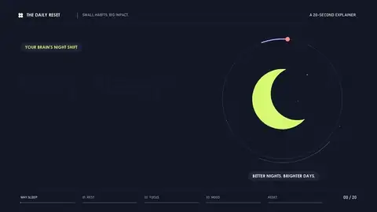</td><td align="center">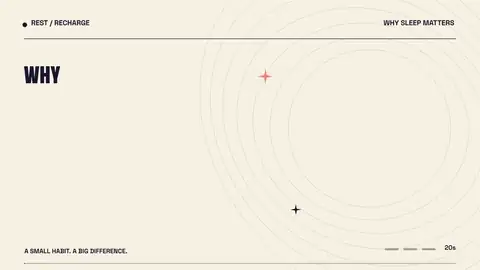</td></tr>
</table>

<div dir="rtl">

<sub>Codex · gpt-6-astra · xhigh: پُری قاب ۱۲٪ ← ۲۶٪ · زمان تقریباً ساکن ۷۳٪ ← ۸٪ · ۲٫۸× توکن · هر خانه یک اجرا</sub>

</div>

<div dir="rtl">

**شوریل رزومه**

</div>

```text
$cinewright make a dynamic 15-second motion graphics video that shows what an incredible motion designer you are, like it's your showreel for a résumé. Go all out.
```

<table dir="ltr">
<tr><th width="50%">Codex · gpt-6-astra · xhigh — بدون اسکیل</th><th width="50%">با Cinewright</th></tr>
<tr><td align="center">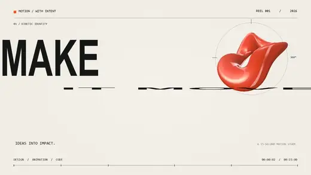</td><td align="center">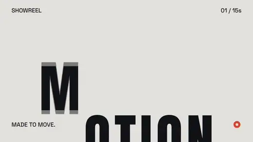</td></tr>
<tr><th width="50%">Claude Code · Sonnet 5.5 — بدون اسکیل</th><th width="50%">با Cinewright</th></tr>
<tr><td align="center">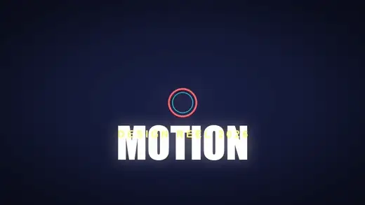</td><td align="center">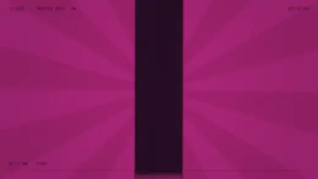</td></tr>
</table>

<div dir="rtl">

<sub>Codex · gpt-6-astra · xhigh: پُری قاب ۲۵٪ ← ۳۰٪ · زمان تقریباً ساکن ۲۵٪ ← ۱۱٪ · ۵٫۵× توکن<br>Claude Code · Sonnet 5.5: پُری قاب ۱۶٪ ← ۴۸٪ · زمان تقریباً ساکن ۲۱٪ ← ۰٪ · هر خانه یک اجرا</sub>

</div>
<!-- FA-PROOF:END -->

<div dir="rtl">

**[▶ همهٔ جفت‌ها را با صدا ببینید](https://msmahdinejad.github.io/cinewright/#results)** — صدا بخشی از نتیجه است. پرامپت‌های سنگین‌تر و سینمایی (فیلم معرفی محصول، تیزر علمی‌تخیلی، ویژوالایزر، بوت رابط) هم در [گزارش بنچمارک](docs/benchmark.md) هستند — از جمله آن‌هایی که اسکیل در آن‌ها نبرد.

</div>

<div dir="rtl">

## نمونه‌های فارسی

</div>

<!-- FA-SHOWCASE:START -->
<table dir="ltr">
<tr><td valign="top" width="50%">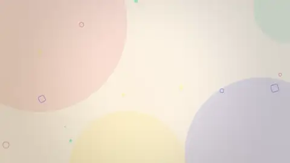<br><sub><b>معرفی یک آدم — مایا چن</b> · Claude Code · Sonnet 5.5 + Cinewright · 15 s<br>پریست «معرفی یک آدم» با متن فارسی: فقط متن عوض شده. گزینهٔ `--lang fa` کل چیدمان را راست‌به‌چپ می‌کند و ارقام را فارسی می‌نویسد؛ موسیقی هم از همان مشخصات ساخته می‌شود.</sub></td><td></td></tr>
</table>

<div dir="rtl">

<details><summary>پرامپت‌هایی که این فیلم‌ها از آن‌ها ساخته شدند</summary>

**معرفی یک آدم — مایا چن**

```text
یک موشن‌گرافی ۱۵ ثانیه‌ای فارسی برای معرفی یک آدم بساز: مایا چن، طراح ارشد محصول از تورنتو (جزئیات را خودت بساز). نام و عنوان، سه مهارت، سه عدد (سال تجربه، پروژه‌های تحویل‌شده، جوایز) و یک نقل‌قول کوتاه را نشان بده و با شناسهٔ @mayachen تمام کن. تمیز، مدرن و پرانرژی. موسیقی و صداگذاری اورجینال. تمام‌قد برو.
```

</details>

</div>

<!-- FA-SHOWCASE:END -->

<div dir="rtl">

## چرا؟

وقتی از یک ایجنت کدنویس «ویدیو» می‌خواهید، معمولاً *اسلایدشو* می‌گیرید: چند محو شدن روی یک گرادیان، بدون دوربین، با صدای تخت. این اسکیل خروجی را در سه سطح عوض می‌کند:

| سطح | چه چیزی اضافه می‌کند |
|---|---|
| **موتور** | جعبه‌ابزار GPU: ویرایشگر صحنه با **۳۲ ترنزیشن**، موتور **سه‌بعدی** (کروم، شیشه، بازتاب، عمق میدان)، **ذرات ۵۰هزارتایی** با مورف، **۲۵ پس‌زمینهٔ شیدری**، **۲۶ فیلتر**، تایپوگرافی جنبشی، دوربین سینمایی و **موتور صدا** (درام، بیس، پد، زهی، سنتور، نی، تمبک…) |
| **دانش** | **اطلس ۲۵۱ تکنیک در ۱۷ خانواده** — هر کدام یک دستورکار کوتاه (کاربرد / روش / پرهیز / ترکیب) با کدی که در CI اجرا می‌شود — به‌علاوهٔ گالری تصویری و `inspire.mjs` که برای هر بریف سه جهت خلاقانهٔ *متفاوت* می‌دهد |
| **فرایند** | پروتکل «استودیو»: بریف ← سبک‌یابی ← اسکلت ← **سه دور صیقل** ← دروازه‌ها؛ با سنجش‌های عینی: معیار ضد-اسلایدشو، کف پُری قاب، کنترل صدا، «دروازهٔ craft» و اثبات قطعی‌بودن |

چون ویدیو فقط `renderFrame(t)` است — تابعی خالص از زمان — ایجنت می‌تواند **هر فریم را جدا** رندر کند، نگاهش کند، یک عدد را اصلاح کند و دوباره رندر کند. همین است که کارش را وارسی می‌کند.

## نصب

به **Node ≥ 18**، **Chrome/Edge** و **ffmpeg** نیاز دارید (نصب‌کننده بررسی می‌کند و می‌گوید چه کم است). `npm install` لازم نیست.

**Codex** (و هر ایجنتی که `~/.agents/skills` را می‌خواند):

</div>

```powershell
irm https://raw.githubusercontent.com/msmahdinejad/cinewright/main/install.ps1 | iex
```

```bash
curl -fsSL https://raw.githubusercontent.com/msmahdinejad/cinewright/main/install.sh | bash
```

<div dir="rtl">

بعد از نصب، ایجنت را کامل ببندید و دوباره باز کنید.

**Claude Code:**

</div>

```text
/plugin marketplace add msmahdinejad/cinewright
/plugin install cinewright@cinewright
```

<div dir="rtl">

**هر ایجنت دیگر:** `npx skills add msmahdinejad/cinewright` · **داکر** (بدون نصب روی سیستم): [راهنما](docs/getting-started.md#docker)

## استفاده

در یک **پوشهٔ خالی** ایجنت را باز کنید و بخواهید. در Codex اسکیل با `$` صدا زده می‌شود؛ عبارت **«go all out»** آن را وارد «حالت استودیو» می‌کند.

</div>

```text
$cinewright یک موشن‌گرافی ۱۵ ثانیه‌ای برای معرفی «سارا احمدی»،
طراح محصول ساکن تهران بساز (جزئیات را خودت بساز): نام و عنوان، سه مهارت، سه عدد (سال تجربه، پروژه، جایزه) و یک جملهٔ کوتاه. تمیز، مدرن و پرانرژی؛ متن فارسی درست شکل‌گرفته و راست‌به‌چپ. موسیقی را خودت بساز. Go all out.
```

```text
$cinewright یک اینفوگرافیک متحرک ۲۰ ثانیه‌ای با عنوان «چرا خواب مهم است» بساز: سه واقعیت، آیکون‌های متحرک، عددهای در حال شمارش، سلسله‌مراتب بصری روشن و موسیقی شاد. Go all out.
```

<div dir="rtl">

خروجی: `out/*.mp4` و همراهش `brief.md` (مفهوم، سبک، لیست شات‌ها با نام تکنیک‌ها)، `video.html` و `audio.mjs` (سورس فیلم) و `qc/` (کانتکت‌شیت و بازبینی‌های نوشته‌شده). سورس کامل فیلم‌های بالا در [`examples/`](examples/) است. پرامپت‌های بیشتر: [نمونه‌پرامپت‌ها](docs/prompts.md).

## بنچمارک: واقعاً کمک می‌کند؟

ادعا ارزان است؛ برای همین ابزار سنجش هم در ریپو هست. [`benchmark/`](benchmark/README.md) **همان پرامپت** را به ایجنت (پیش‌فرض Codex) **با اسکیل و بدون اسکیل** می‌دهد (در حالت بدون اسکیل، هر نسخهٔ نصب‌شده غیرفعال می‌شود)، بعد هر فیلم را می‌سنجد (حرکت، پُری قاب، بلندی صدا، فرایند) و یک صفحهٔ **رأی‌گیری کور A/B** برای سلیقه می‌دهد. هر ایجنت فقط با خودش مقایسه می‌شود.

</div>

```bash
node benchmark/run.mjs --suite headline --models gpt-6-astra,gpt-6.1-sol --effort xhigh   # اثبات بالا
node benchmark/rate.mjs <run-id>                                                          # رأی‌گیری کور
node benchmark/report.mjs                                                                 # → docs/benchmark.md
```

<div dir="rtl">

جدول‌ها، کانتکت‌شیت‌ها و لاگ توسعه (از جمله اولین اجرا، که اسکیل در آن *باخت*): [docs/benchmark.md](docs/benchmark.md).

## محدودیت‌ها (صادقانه)

- این ابزار **گرافیک** می‌سازد، نه عکس/فیلم واقعی: آدم و حیوان فوتورئال ندارد.
- کیفیت نهایی به ایجنت و مدل هم بستگی دارد؛ اسکیل کف کیفیت را بالا می‌برد و ابزار بهتر می‌دهد، نه اینکه شاهکار تضمین کند — و توکن بیشتری مصرف می‌کند (در اندازه‌گیری‌های ما چندین برابر اجرای ساده). بنچمارک برای همین است.
- سازهای ایرانی (سنتور، نی، تمبک، دف) شبیه‌سازی هستند، نه ضبط واقعی.
- فونت چینی/ژاپنی/کره‌ای/عبری/هندی همراه نیست (با `K.loadFonts` اضافه کنید).

## مشارکت و مجوز

تکنیک جدید برای اطلس، نتایج بنچمارک، گزارش باگ و ترجمه خوش‌آمد است — [CONTRIBUTING.md](CONTRIBUTING.md). مجوز: MIT؛ فونت‌های همراه SIL OFL (جزئیات: [THIRD_PARTY_NOTICES.md](THIRD_PARTY_NOTICES.md)). فیلم‌هایی که می‌سازید مال خودتان است.

</div>
