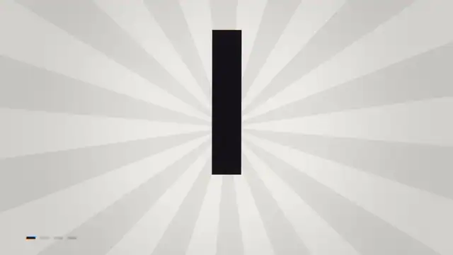
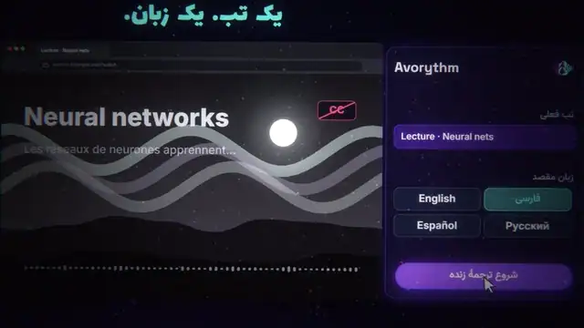
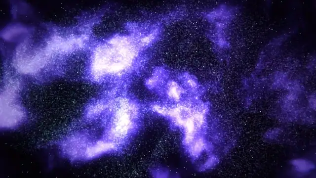
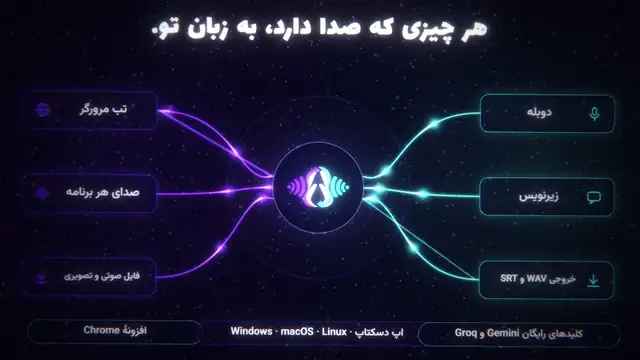
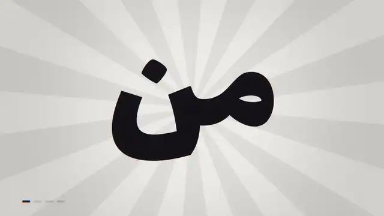

<div align="center">



# Cinewright

**An agent skill that teaches Codex, Claude Code and friends to make cinema-grade videos — entirely from code.**

Every frame is a deterministic WebGL/canvas page. Every sound is synthesised. No stock footage, no video model, no cloud. Persian & RTL are first-class.

[](https://github.com/msmahdinejad/cinewright/actions/workflows/ci.yml)
[](LICENSE)
[](skills/cinewright/SKILL.md)
[](package.json)

[**Website** (live engine demo)](https://msmahdinejad.github.io/cinewright/) · [Getting started](docs/getting-started.md) · [Atlas](docs/atlas.md) · [Prompt cookbook](docs/prompts.md) · [Benchmark](docs/benchmark.md) · [**فارسی**](README.fa.md)

</div>

> **Formerly `pure-code-video`.** Renamed in 2.1.0 — same project, shorter name. To upgrade, run the installer again: it removes the old `pure-code-video` copy and installs `cinewright`. The agent prompt is now `$cinewright`.

---

## See what it makes

<table>
<tr>
<td width="50%"><br><sub><b>Product film</b> (30 s, Persian RTL, original score) — a prism splits one voice into four outputs. <a href="https://github.com/msmahdinejad/cinewright/releases/download/v2.1.0/avorythm-film.mp4">MP4</a> · <a href="skills/cinewright/references/case-studies/avorythm/README.md">how it was made</a></sub></td>
<td width="50%"><br><sub><b>Cinema template</b> (20 s) — particles → chrome 3D name → kinetic poster → night-city flight → burst. <a href="https://github.com/msmahdinejad/cinewright/releases/download/v2.1.0/cinema-template.mp4">MP4</a></sub></td>
</tr>
<tr>
<td><br><sub><b>Particles → logo</b> — 50 000 GPU points morph from scripts into the mark, with a shock ring and a camera punch on the hit.</sub></td>
<td><br><sub><b>Showreel template, Persian</b> (17.5 s) — slam type, 3D plastic, girih pattern, liquid metal, tunnel. <a href="https://github.com/msmahdinejad/cinewright/releases/download/v2.1.0/showreel-template-fa.mp4">MP4</a></sub></td>
</tr>
</table>

> The films above were built by an agent following this skill (the templates are the starting points it chooses from). Want to test it yourself? Jump to [Install](#install) — or measure it first with the [benchmark](#benchmark-does-it-actually-help).

## Why

Ask a coding agent for a video and you usually get a *slideshow*: a few fades over a gradient, no camera, silent or flat sound. This skill changes the outcome at three levels:

| level | what it adds |
|---|---|
| **Engine** | a GPU film toolkit that makes spectacular looks cheap: scene sequencer with **32 transitions**, a from-scratch **3D renderer** (chrome, glass, reflections, depth of field), **50 000-particle morphs**, **25 shader backgrounds**, **26 filters**, kinetic type, camera tools, and a **sound engine** (drums, strings, santur, ney, tombak…) |
| **Knowledge** | an **atlas of 239 techniques in 17 families** — each a short recipe (use / how / avoid / pairs-with) with code that is executed in CI — plus a visual gallery so the agent can *see* options, and `inspire.mjs`, which turns any brief into three *different* creative directions |
| **Process** | a "studio mode" protocol — brief → look-dev → skeleton → three polish rounds → gates — with **objective checks**: an anti-slideshow motion metric, audio QC, a craft gate (brief written? ≥ 6 techniques from ≥ 4 families? ≥ 4 transitions? three review rounds?) and a determinism proof |

Because a video is just `renderFrame(t)` — a pure function of time — an agent can render **any single frame**, look at it, fix one number and render again. That is how it checks its own work without eyes or ears. [How it works →](docs/how-it-works.md)

## Install

You need **Node ≥ 18**, **Chrome/Edge/Chromium** and **ffmpeg** (the installer checks and tells you what is missing). No `npm install`.

<details open>
<summary><b>Codex</b> (CLI or app) — and any agent that reads <code>~/.agents/skills</code></summary>

```powershell
# Windows PowerShell
irm https://raw.githubusercontent.com/msmahdinejad/cinewright/main/install.ps1 | iex
```

```bash
# macOS / Linux / Git-Bash
curl -fsSL https://raw.githubusercontent.com/msmahdinejad/cinewright/main/install.sh | bash
```

Restart the agent afterwards so it rescans skills. (`-Target codex|claude`, `-Project` for one repository, `-Ref v2.0.0` to pin a version — see the header of the script.)
</details>

<details>
<summary><b>Claude Code</b> — plugin marketplace</summary>

```text
/plugin marketplace add msmahdinejad/cinewright
/plugin install cinewright@cinewright
```
</details>

<details>
<summary><b>Any agent</b> — <code>npx skills</code></summary>

```bash
npx skills add msmahdinejad/cinewright
```
</details>

<details>
<summary><b>Docker</b> — nothing installed on your machine</summary>

```bash
docker build -t cinewright https://github.com/msmahdinejad/cinewright.git
docker run --rm -v "$PWD/film:/work" cinewright scaffold /work --template showreel
docker run --rm -v "$PWD/film:/work" cinewright render
```
</details>

## Use it

In an **empty folder**, start your agent and ask. In Codex the skill is invoked with `$`; say **"go all out"** to switch it into studio mode.

```text
$cinewright make a dynamic 15-second motion graphics video that shows what an incredible
motion designer you are, like it's your showreel for a résumé. Go all out.
```

You get `out/*.mp4`, plus the artefacts that make the work reviewable: `brief.md` (concept, style bible, shot list with technique ids), `video.html` + `audio.mjs` (the film's source), `qc/` (contact sheets and written review rounds). More prompts for product films, logo stings, trailers, explainers, vertical reels and Persian projects: **[prompt cookbook](docs/prompts.md)**.

## The atlas, at a glance

239 techniques in 17 families. Browse the [full catalogue](docs/atlas.md) or ask the atlas from your terminal: `node skills/cinewright/scripts/atlas.mjs search liquid chrome 3d text`.

<table>
<tr>
<td width="25%"><br><sub><b>3D</b> — chrome text, glass gems, night city, pedestal</sub></td>
<td width="25%"><br><sub><b>Particles</b> — morph, burst, galaxy, dissolve</sub></td>
<td width="25%"><br><sub><b>Type</b> — slam, write-on, karaoke captions, rings</sub></td>
<td width="25%"><br><sub><b>Logos</b> — shockwave, shatter-in, glitch, bloom ring</sub></td>
</tr>
<tr>
<td><br><sub><b>Shaders</b> — metaballs, retro sun, warp, cracks</sub></td>
<td><br><sub><b>Looks</b> — VHS, ASCII, stained glass, kaleidoscope</sub></td>
<td><br><sub><b>Graphic</b> — girih, dot globe, flow field, equalizer</sub></td>
<td><br><sub><b>UI & light</b> — app flow, statistic grid, graph, neon</sub></td>
</tr>
</table>

Every entry above is real code from the atlas — render any of them yourself: `node skills/cinewright/scripts/atlas.mjs clip logo-shatter-in --gif`.

## Benchmark: does it actually help?

Claims are cheap, so the repo ships the means to measure them. [`benchmark/`](benchmark/README.md) gives a coding agent (Codex by default) the **same prompt** in a fresh folder **with and without the skill** — the baseline run has any installed copy of the skill disabled — then measures each film (motion, pacing, loudness, process) and offers a blind A/B rating page for taste.

```bash
node benchmark/run.mjs --suite quick        # 3 tasks × (no skill, with skill)
node benchmark/rate.mjs <run-id>            # blind human rating
node benchmark/report.mjs                   # → docs/benchmark.md
```

<!-- BENCH:START -->
**Measured so far** (4 runner result(s) + 3 earlier output(s) measured after the fact — every row says how it was made; details and caveats in [docs/benchmark.md](docs/benchmark.md)):

| task | how it was made | length | quiet % ↓ | loudness range (LU) |
|---|---|---:|---:|---:|
| `logo-sting-6s` | Codex, no skill (runner) | 6 s | 45 | 6.7 |
| `logo-sting-6s` | Codex + Cinewright (first 2.1 build) (runner) | ✘ | – | – |
| `product-avorythm` | Codex + skill v1.1 (measured after the fact) | 44 s | 61 | 6.1 |
| `product-avorythm` | Claude + skill v2 (measured after the fact) | 30 s | 0 | 5.9 |
| `showreel-15s` | Codex, no skill (runner) | 15 s | 0 | 1 |
| `showreel-15s` | Codex + skill v1.1 (measured after the fact) | 15 s | 11 | 3.5 |
| `showreel-15s` | Codex + Cinewright (first 2.1 build) (runner) | 15 s | 21 | 0.9 |

*quiet % = share of the film where almost nothing changes (lower is better).*
<!-- BENCH:END -->

Full tables, contact sheets and caveats: **[docs/benchmark.md](docs/benchmark.md)**. Run it with your agent and share the result — especially if it contradicts us.

## Documentation

| | |
|---|---|
| [Getting started](docs/getting-started.md) | install per agent, check your machine, first film, Docker, troubleshooting |
| [How it works](docs/how-it-works.md) | the engine, the atlas, the protocol and gates |
| [Prompt cookbook](docs/prompts.md) | prompts that work, per domain (English & Persian), and how to steer |
| [Atlas](docs/atlas.md) | all 239 techniques with galleries |
| [Benchmark](docs/benchmark.md) | method, metrics, results |
| [FAQ](docs/faq.md) | limits, licensing, safety |
| [Site guide](docs/site-guide.md) | how the website is built — and `tools/new-site.mjs`, which generates one like it for any repository from a JSON file |
| [`SKILL.md`](skills/cinewright/SKILL.md) · [`protocol.md`](skills/cinewright/references/protocol.md) · [`engine.md`](skills/cinewright/references/engine.md) | what the agent reads |

## Limits (honestly)

- It makes **graphics**, not photographs: no photoreal people, animals or footage.
- The final quality still depends on the agent and model driving it; the skill raises the floor and gives it better tools, it does not guarantee a masterpiece. That is exactly what the benchmark is for.
- Persian instruments (santur, ney, tombak, daf) are synthesised approximations, not recordings.
- No CJK / Hebrew / Indic fonts are bundled (add one with `K.loadFonts`).

## Contributing

New atlas techniques, benchmark results, bug reports and translations are welcome — see [CONTRIBUTING.md](CONTRIBUTING.md). Please follow the [Code of Conduct](CODE_OF_CONDUCT.md); security issues go through [SECURITY.md](SECURITY.md).

## License

MIT © Mohammad Saleh Mahdinejad and contributors — see [LICENSE](LICENSE). Bundled fonts: SIL OFL 1.1, see [THIRD_PARTY_NOTICES.md](THIRD_PARTY_NOTICES.md). If this helps your work, a ⭐ and a link to what you made is the nicest thank-you. Citation metadata: [CITATION.cff](CITATION.cff).
