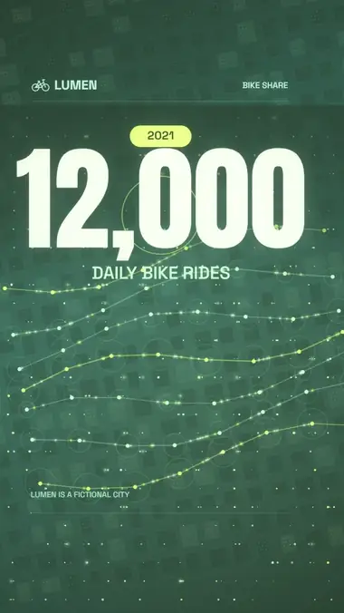
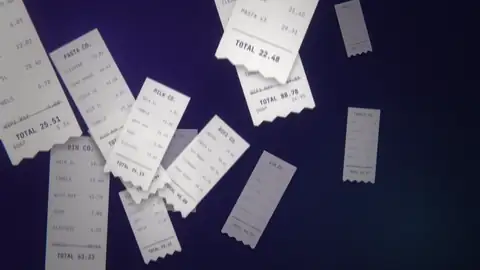
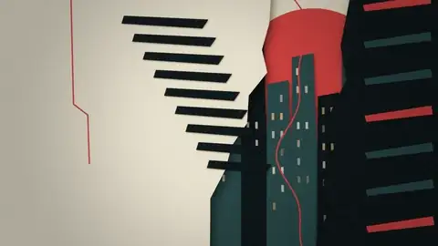
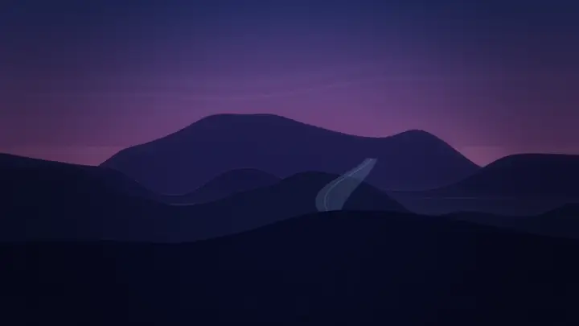

<div align="center">


# Cinewright

**Your coding agent can now direct films.**

An open-source skill for Codex, Claude Code and friends. Every frame is a deterministic WebGL/canvas page, every sound is synthesised — no stock footage, no video model, no cloud. Same prompt, same agent: the difference is the skill.

[](https://github.com/msmahdinejad/cinewright/actions/workflows/ci.yml)
[](LICENSE)
[](skills/cinewright/SKILL.md)
[](package.json)

[**Website** — watch the films with sound](https://msmahdinejad.github.io/cinewright/) · [Getting started](docs/getting-started.md) · [Atlas](docs/atlas.md) · [Prompt cookbook](docs/prompts.md) · [Benchmark](docs/benchmark.md) · [**فارسی**](README.fa.md)

</div>

> **Formerly `pure-code-video`.** Renamed in 2.1.0 — same project, shorter name. To upgrade, run the installer again: it removes the old copy and installs `cinewright`. The agent prompt is `$cinewright`.

---

## The proof: same prompt, same agent — with and without the skill

We gave each agent the identical request in a clean folder. The only difference: the skill. Codex ran unattended at **xhigh** reasoning; every agent is compared with *itself*, never with another agent. First the jobs people ask for most — plain motion graphics, no 3D spectacle — then the résumé showreel:

<!-- PROOF:START -->
**Introduce a person**

```text
$cinewright Make a 15-second motion graphics video that introduces a person: Maya Chen, a senior product designer from Toronto (invent the details). Show her name and role, three skills, three numbers (years of experience, projects shipped, awards) and a short quote, and end on her handle @mayachen. Clean, modern, energetic — the kind of intro a personal brand would open a talk or a portfolio with. Original music and sound design. Go all out.
```

<table dir="ltr">
<tr><th width="50%">Codex · gpt-6-astra · xhigh — <i>without</i> the skill</th><th width="50%">… and <i>with</i> Cinewright</th></tr>
<tr><td align="center"></td><td align="center"></td></tr>
</table>

<sub>Codex · gpt-6-astra · xhigh: frame fill 14% → 50% · near-static 57% → 0% · 2.8× the tokens · one run per cell</sub>

**Vertical social promo**

```text
$cinewright Make a 12-second vertical (9:16) social-media promo for a fictional coffee shop called "Brew & Co." announcing three autumn drinks with prices — Maple Latte €4.50, Spiced Cold Brew €4.00, Pumpkin Mocha €4.80 — and a call to action: "Open daily 7–19 · Main Street". Bold type, flat shapes and simple icon drawings (cups, leaves, beans), a beat-synced edit, punchy sound. Go all out.
```

<table dir="ltr">
<tr><th width="50%">Codex · gpt-6-astra · xhigh — <i>without</i> the skill</th><th width="50%">… and <i>with</i> Cinewright</th></tr>
<tr><td align="center"></td><td align="center"></td></tr>
</table>

<sub>Codex · gpt-6-astra · xhigh: frame fill 36% → 37% · near-static 41% → 0% · 3.6× the tokens · one run per cell</sub>

**Channel intro**

```text
$cinewright Make an 8-second YouTube channel intro for a fictional tech-review channel called "Pixel Pulse": a logo mark that builds itself, the name, a one-line tagline you write, punchy transitions and sound design (a hit, whooshes, a short musical sting). Bold, bright, memorable. Go all out.
```

<table dir="ltr">
<tr><th width="50%">Codex · gpt-6-astra · xhigh — <i>without</i> the skill</th><th width="50%">… and <i>with</i> Cinewright</th></tr>
<tr><td align="center"></td><td align="center"></td></tr>
</table>

<sub>Codex · gpt-6-astra · xhigh: frame fill 9% → 31% · near-static 57% → 14% · 5.1× the tokens · one run per cell</sub>

**Animated infographic**

```text
$cinewright Make a 20-second animated infographic explainer titled "Why sleep matters" with three facts — adults need 7–9 hours; one night of poor sleep can cut focus by about a third; a regular bedtime improves mood — each with an animated icon or chart (moon, brain, clock), counting numbers, a clear visual hierarchy, upbeat original music and sound design. Go all out.
```

<table dir="ltr">
<tr><th width="50%">Codex · gpt-6-astra · xhigh — <i>without</i> the skill</th><th width="50%">… and <i>with</i> Cinewright</th></tr>
<tr><td align="center"></td><td align="center"></td></tr>
</table>

<sub>Codex · gpt-6-astra · xhigh: frame fill 12% → 26% · near-static 73% → 8% · 2.8× the tokens · one run per cell</sub>

**Résumé showreel**

```text
$cinewright make a dynamic 15-second motion graphics video that shows what an incredible motion designer you are, like it's your showreel for a résumé. Go all out.
```

<table dir="ltr">
<tr><th width="50%">Codex · gpt-6-astra · xhigh — <i>without</i> the skill</th><th width="50%">… and <i>with</i> Cinewright</th></tr>
<tr><td align="center"></td><td align="center"></td></tr>
<tr><th width="50%">Claude Code · Sonnet 5.5 — <i>without</i> the skill</th><th width="50%">… and <i>with</i> Cinewright</th></tr>
<tr><td align="center"></td><td align="center"></td></tr>
</table>

<sub>Codex · gpt-6-astra · xhigh: frame fill 25% → 30% · near-static 25% → 11% · 5.5× the tokens<br>Claude Code · Sonnet 5.5: frame fill 16% → 48% · near-static 21% → 0% · one run per cell</sub>
<!-- PROOF:END -->

**[▶ Watch every pair with sound](https://msmahdinejad.github.io/cinewright/#results)** — the soundtrack is part of the result. Heavier, cinematic prompts (a launch film, a sci-fi teaser, a visualizer, an interface boot) are in the [benchmark report](docs/benchmark.md) too — including the ones the skill did not win.

<!-- BENCH:START -->
**Everyday motion graphics, Codex · gpt-6-astra · xhigh** — every complete pair we ran, not a selection (each cell = frame fill % ↑ · static % ↓ · loudness range LU ↑; **bold** = the better cell on balance; one run per cell — [details & caveats](docs/benchmark.md)):

| prompt | without Cinewright | with Cinewright |
|---|---|---|
| Introduce a person | 14% · 57% · 1.2 | **50% · 0% · 1.5** |
| Vertical social promo | 36% · 41% · 0.4 | **37% · 0% · 0.8** |
| YouTube channel intro | 9% · 57% · 7 | **31% · 14% · 0.7** |
| Animated infographic | 12% · 73% · 0.8 | **26% · 8% · 2.2** |

**The résumé showreel prompt, each agent against itself:**

| agent | without Cinewright | with Cinewright |
|---|---|---|
| Codex · gpt-6-astra · xhigh | 25% · 25% · 0.2 | **30% · 11% · 1.2** |
| Codex · gpt-6.1-sol · xhigh | 30% · 11% · 1.4 | 30% · 14% · 2.3 |
| Claude Code · Sonnet 5.5 | 16% · 21% · 2 | **48% · 0% · 1.9** |

**Strong cinematic prompts, Codex · gpt-6-astra · xhigh** — also every complete pair, including the ones the skill did not win:

| prompt | without Cinewright | with Cinewright |
|---|---|---|
| Product launch film — ARC | **11% · 32% · 6.2** | 13% · 64% · 5.4 |
| Sci-fi teaser — LAST SIGNAL | **14% · 46% · 11.8** | 8% · 54% · 9.2 |
| Audio-reactive music visualizer | **37% · 0% · 4.6** | 22% · 16% · 4.6 |
| Sci-fi interface boot sequence | 9% · 82% · 9.5 | **26% · 25% · 6.4** |

*The numbers check motion and sound hygiene, not beauty — [watch the films with sound](https://msmahdinejad.github.io/cinewright/#results).*
<!-- BENCH:END -->

*One run per cell: an anecdote, not a verdict. The Claude pair was made in an interactive session by the same Claude that wrote the skill — not blind. We publish every run, including the ones the skill does not win ([development log](docs/benchmark.md)).*

## Made with it

<!-- SHOWCASE:START -->
<table dir="ltr">
<tr><td valign="top" width="50%"><br><sub><b>Frame Summit 2026 — a 15-second event promo</b> · Claude Code · Sonnet 5.5 + Cinewright · 15 s<br>Title with a calendar badge → three speaker rows with a light sweep → the date as three colour floods, one word per beat → a pulsing handle and a button. The whole film is a JSON spec; picture and sound are both drawn from it.</sub></td><td valign="top" width="50%"><br><sub><b>LUMEN — a 15-second vertical data story</b> · Codex · gpt-6-astra · xhigh + Cinewright · 15 s<br>12,000 → 87,000 daily rides: a city of dots grows into a river of light, the numbers count up, a line chart draws itself and the drop lands on 87,000. 1080×1920 with phone safe areas.</sub></td></tr>
<tr><td valign="top" width="50%"><br><sub><b>Pocketwise — a 20-second app explainer</b> · Claude Code · Sonnet 5.5 + Cinewright · 20 s<br>Receipts and group-chat nagging → a 3D phone running a live app UI → gold coins settling four balances to €0.00 after one breath of silence → a monthly dashboard → the mark. Original lo-fi score and UI foley; every frame is code.</sub></td><td valign="top" width="50%"><br><sub><b>Kinetic manifesto — “We build it”</b> · Claude Code · Sonnet 5.5 + Cinewright · 20 s<br>Seven typographic treatments in 20 s on a 174 BPM drum & bass track: slams, a decode, 3D words with a camera flight, stepped frames, drawn outlines, a glitching serif, one beat of silence, particles.</sub></td></tr>
<tr><td valign="top" width="50%"><br><sub><b>THE HOLLOW HOURS — a prestige title sequence</b> · Codex · gpt-6-astra · xhigh + Cinewright · 25 s<br>Cut-paper skyline, a flickering neon sign, rain on glass, a clock whose hands unravel into thread, a silhouette made of falling particles — drawn in code, scored with a heartbeat pulse and a brass swell.</sub></td><td valign="top" width="50%"><br><sub><b>Dusk, moonrise, fireflies — no text</b> · Codex · gpt-6-astra · xhigh + Cinewright · 15 s<br>A meditative landscape you could loop all evening: layered ridges, drifting mist, a rising moon, fireflies and a gentle original ambient score.</sub></td></tr>
</table>

<details><summary>The prompts these films were made from</summary>

**Frame Summit 2026 — a 15-second event promo**

```text
Make a 15-second motion graphics promo for a fictional design conference, "Frame Summit 2026 · Oct 14–16 · Lisbon": three speakers with their talk titles, a big date moment, bold typography and shapes, and the call to action "Get tickets at framesummit.io". Energetic, modern, with a beat-synced edit and sound design. Go all out.
```

**LUMEN — a 15-second vertical data story**

```text
Make a 15-second VERTICAL (9:16) social video that makes people feel one statistic: in the fictional city of Lumen, daily bike-share rides grew from 12,000 in 2021 to 87,000 in 2025. Hook in the first second (a number slams in), one hero visual (a city of dots growing into a river of light), big readable numbers that count up, a map or line-chart moment, a beat drop where 87,000 lands, safe areas for phone UI, punchy music with a drop, and an end card with a one-line takeaway. Go all out.
```

**Pocketwise — a 20-second app explainer**

```text
Make a 20-second explainer video for "Pocketwise", a fictional app that turns shared household expenses into a simple monthly summary. Show the problem, the app UI (invent the screens), one satisfying data moment (numbers/chart), and end with the name and a one-line tagline. Original music and UI sound design. Go all out.
```

**Kinetic manifesto — “We build it”**

```text
Make a 20-second kinetic typography film that delivers this manifesto word for word: "We don't wait for inspiration. We build it. Frame by frame. Line by line. Until the thing you imagined starts to move." Type is the only hero — at least six different typographic treatments (mask reveal, slice, 3D extrusion with perspective, outline-to-fill, scale-through, glitch, per-letter physics) on a driving original drum-and-bass track at 174 BPM with every cut on the beat. Two saturated colours plus one neutral, huge type (at least 40 % of the frame height), a full-bleed colour flood every ~4 s, one camera flight through the letters in 3D and one beat of total silence before the last line. Sound: drums, bass, risers and a synth stab on every key word. Go all out.
```

**THE HOLLOW HOURS — a prestige title sequence**

```text
Make a 25-second main-title sequence for a fictional prestige thriller series called "THE HOLLOW HOURS" (a night-shift detective in a city that never sleeps) — Saul Bass meets a modern streaming title. Build everything from abstract shapes, light, grain and type: cut-paper layers that peel apart, a flickering neon sign, rain streaking down glass with bokeh street lights, a clock whose hands unravel into thread, a silhouette made of falling particles. Credit-style typography with invented names ("Created by …", "Starring …"), a brooding original score with a heartbeat pulse and a low brass swell, and a final title lock-up that holds for two seconds. Go all out.
```

**Dusk, moonrise, fireflies — no text**

```text
Make a 15-second meditative cinematic landscape with no text at all: dusk over a procedural terrain with layered mountain ridges, drifting mist, an aurora ribbon in the sky, a slowly rising moon, fireflies, a slow crane move. A gentle original ambient score (pads, a soft pluck, sparse bells). Palette: deep indigo to rose gold. Make it so beautiful that someone would loop it. Go all out.
```

</details>

<!-- SHOWCASE:END -->

## Why

Ask a coding agent for a video and you usually get a *slideshow*: a few fades over a gradient, no camera, silent or flat sound. This skill changes the outcome at three levels:

| level | what it adds |
|---|---|
| **Engine** | a GPU film toolkit that makes spectacular looks cheap: scene sequencer with **32 transitions**, a from-scratch **3D renderer** (chrome, glass, reflections, depth of field), **50 000-particle morphs**, **25 shader backgrounds**, **26 filters**, kinetic type, camera tools, and a **sound engine** (drums, bass, pads, strings, keys, risers, impacts…) |
| **Knowledge** | an **atlas of 251 techniques in 17 families** — each a short recipe (use / how / avoid / pairs-with) with code that is executed in CI — plus a visual gallery so the agent can *see* options, and `inspire.mjs`, which turns any brief into three *different* creative directions |
| **Process** | a "studio mode" protocol — brief → look-dev → skeleton → three polish rounds → gates — with **objective checks**: an anti-slideshow motion metric, a frame-fill floor, audio QC, a craft gate (brief written? ≥ 6 techniques from ≥ 4 families? ≥ 4 transitions? three real review rounds?) and a determinism proof |

Because a video is just `renderFrame(t)` — a pure function of time — an agent can render **any single frame**, look at it, fix one number and render again. That is how it checks its own work. [How it works →](docs/how-it-works.md)

## Install

You need **Node ≥ 18**, **Chrome/Edge/Chromium** and **ffmpeg** (the installer checks and tells you what is missing). No `npm install`.

<details open>
<summary><b>Codex</b> (CLI or app) — and any agent that reads <code>~/.agents/skills</code></summary>

```powershell
# Windows PowerShell
irm https://raw.githubusercontent.com/msmahdinejad/cinewright/main/install.ps1 | iex
```

```bash
# macOS / Linux / Git-Bash
curl -fsSL https://raw.githubusercontent.com/msmahdinejad/cinewright/main/install.sh | bash
```

Restart the agent afterwards so it rescans skills. (`-Target codex|claude`, `-Project` for one repository, `-Ref v2.2.0` to pin a version — see the header of the script.)
</details>

<details>
<summary><b>Claude Code</b> — plugin marketplace</summary>

```text
/plugin marketplace add msmahdinejad/cinewright
/plugin install cinewright@cinewright
```
</details>

<details>
<summary><b>Any agent</b> — <code>npx skills</code></summary>

```bash
npx skills add msmahdinejad/cinewright
```
</details>

<details>
<summary><b>Docker</b> — nothing installed on your machine</summary>

```bash
docker build -t cinewright https://github.com/msmahdinejad/cinewright.git
docker run --rm -v "$PWD/film:/work" cinewright scaffold /work --template showreel
docker run --rm -v "$PWD/film:/work" cinewright render
```
</details>

## Use it

In an **empty folder**, start your agent and ask. In Codex the skill is invoked with `$`; say **"go all out"** to switch it into studio mode.

```text
$cinewright make a dynamic 15-second motion graphics video that shows what an incredible
motion designer you are, like it's your showreel for a résumé. Go all out.
```

You get `out/*.mp4`, plus the artefacts that make the work reviewable: `brief.md` (concept, style bible, shot list with technique ids), `video.html` + `audio.mjs` (the film's source), `qc/` (contact sheets and written review rounds). More prompts — product films, logo stings, trailers, explainers, vertical reels, music visualizers — in the **[prompt cookbook](docs/prompts.md)**; the complete source of the Claude showreel above (brief, code, three review rounds) is in [`examples/`](examples/).

## The atlas, at a glance

251 techniques in 17 families. Browse the [full catalogue](docs/atlas.md) or ask the atlas from your terminal: `node skills/cinewright/scripts/atlas.mjs search liquid chrome 3d text`. The reels below are rendered by the atlas itself.

<table>
<tr>
<td width="25%"><br><sub><b>3D</b> — chrome text, night city, helix, synthwave</sub></td>
<td width="25%"><br><sub><b>Particles</b> — morph, galaxy, burst, mesh</sub></td>
<td width="25%"><br><sub><b>Type</b> — slam, echo stack, extrude, text window</sub></td>
<td width="25%"><br><sub><b>Logos</b> — shockwave, shatter-in, glitch, bloom ring</sub></td>
</tr>
<tr>
<td><br><sub><b>Shaders</b> — metaballs, retro sun, Julia, truchet</sub></td>
<td><br><sub><b>Looks</b> — VHS, ASCII, stained glass, kaleidoscope</sub></td>
<td><br><sub><b>Graphic</b> — girih, flow field, sunburst, dot globe</sub></td>
<td><br><sub><b>UI</b> — dashboard, code typing, toasts, donut</sub></td>
</tr>
</table>

Every entry above is real code from the atlas — render any of them yourself: `node skills/cinewright/scripts/atlas.mjs clip logo-shatter-in --gif`.

## Benchmark: does it actually help?

Claims are cheap, so the repo ships the means to measure them. [`benchmark/`](benchmark/README.md) gives a coding agent (Codex by default, any agent through `--agent-cmd`) the **same prompt** in a fresh folder **with and without the skill** — the baseline run has any installed copy of the skill disabled — then measures each film (motion, frame fill, loudness, process) and offers a blind A/B rating page for taste.

```bash
node benchmark/run.mjs --suite headline --models gpt-6-astra,gpt-6.1-sol --effort xhigh   # the proof above
node benchmark/rate.mjs <run-id>                                                          # blind human rating
node benchmark/report.mjs                                                                 # → docs/benchmark.md
```

Full tables, contact sheets, the development log (including the first run, where the skill *lost*) and caveats: **[docs/benchmark.md](docs/benchmark.md)**. Run it with your agent and share the result — especially if it contradicts us.

## Documentation

| | |
|---|---|
| [Getting started](docs/getting-started.md) | install per agent, check your machine, first film, Docker, troubleshooting |
| [How it works](docs/how-it-works.md) | the engine, the atlas, the protocol and gates |
| [Prompt cookbook](docs/prompts.md) | prompts that work, per domain, and how to steer |
| [Atlas](docs/atlas.md) | all 251 techniques with galleries |
| [Benchmark](docs/benchmark.md) | method, metrics, results, development log |
| [FAQ](docs/faq.md) | limits, licensing, safety |
| [Site guide](docs/site-guide.md) | how the website is built — and `tools/new-site.mjs`, which generates one like it for any repository from a JSON file |
| [`examples/`](examples/) | the source of the films above: brief, code, review rounds |
| [`SKILL.md`](skills/cinewright/SKILL.md) · [`protocol.md`](skills/cinewright/references/protocol.md) · [`engine.md`](skills/cinewright/references/engine.md) | what the agent reads |

## Limits (honestly)

- It makes **graphics**, not photographs: no photoreal people, animals or footage.
- The final quality still depends on the agent and model driving it; the skill raises the floor and gives it better tools, it does not guarantee a masterpiece — and it costs tokens (several times a plain run in our measurements). That is exactly what the benchmark is for.
- Right-to-left scripts (Persian, Arabic) are shaped correctly; see the [Persian README](README.fa.md). No CJK / Hebrew / Indic fonts are bundled (add one with `K.loadFonts`).
- Instruments are synthesised approximations, not recordings.

## Contributing

New atlas techniques, benchmark results, bug reports and translations are welcome — see [CONTRIBUTING.md](CONTRIBUTING.md). Please follow the [Code of Conduct](CODE_OF_CONDUCT.md); security issues go through [SECURITY.md](SECURITY.md).

## License

MIT © Mohammad Saleh Mahdinejad and contributors — see [LICENSE](LICENSE). Bundled fonts: SIL OFL 1.1, see [THIRD_PARTY_NOTICES.md](THIRD_PARTY_NOTICES.md). If this helps your work, a ⭐ and a link to what you made is the nicest thank-you. Citation metadata: [CITATION.cff](CITATION.cff).
