# The technique atlas

<!-- GENERATED by tools/gen-docs.mjs from skills/cinewright/references/atlas/*.md — edit the atlas, not this file. -->

**239 techniques in 17 families.** Every entry is a short recipe (what it is for, how it works, what to avoid, what pairs with it) and, for most, **code that runs** — the CI-friendly test `node skills/cinewright/scripts/atlas.mjs test all` executes every one of them (167 runnable blocks) so a recipe never rots.

Agents use the atlas through three commands; you can use them too:

```bash
node skills/cinewright/scripts/atlas.mjs search liquid chrome 3d text   # ranked entries for what you want to do
node skills/cinewright/scripts/atlas.mjs show text3d-chrome             # the full recipe with code
node skills/cinewright/scripts/atlas.mjs clip logo-shatter-in --gif     # render it as real motion (MP4 + GIF)
```

| family | entries | what it is |
|---|---:|---|
| [camera](#camera) | 11 | the difference between "slides" and "film" |
| [color](#color) | 4 | palettes, grades and the "limited palette" rule |
| [editing](#editing) | 15 | pacing, structure and rhythm (what makes it feel directed) |
| [graphic](#graphic) | 15 | 2D motion-design vocabulary (no 3D, no shaders needed) |
| [ideas](#ideas) | 27 | concepts, metaphors, hooks and endings (read BEFORE you write brief.md) |
| [light](#light) | 9 | what makes a frame feel photographed |
| [logos](#logos) | 10 | ten ways to reveal a mark |
| [looks](#looks) | 20 | the filter and grade that give a film its identity |
| [particles](#particles) | 13 | tens of thousands of points, closed-form, deterministic |
| [pipelines](#pipelines) | 8 | the glue patterns that make a film feel like one piece |
| [shaders](#shaders) | 11 | backgrounds you can name, and GLSL you can write in ten lines |
| [sound](#sound) | 17 | the half of the film people feel before they see it |
| [styles](#styles) | 22 | complete visual systems (pick ONE per film, then commit) |
| [three-d](#three-d) | 15 | a real-time engine, no assets, any script (Scene3D) |
| [transitions](#transitions) | 7 | how one scene becomes the next |
| [type](#type) | 24 | kinetic type that carries the message |
| [ui-data](#ui-data) | 11 | interfaces, numbers and charts that look designed |

## camera

**Camera — the difference between "slides" and "film"**

<details><summary>Contact sheet — every recipe of this family at its best frame</summary>

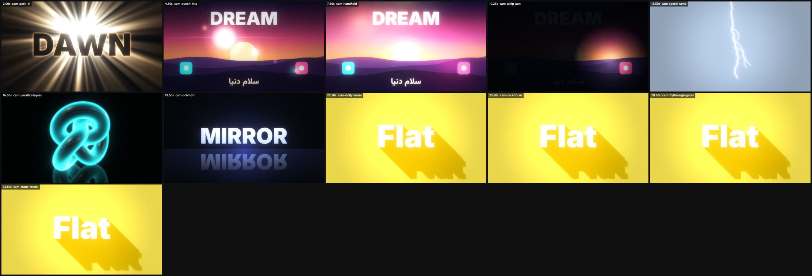

</details>

| id | title | use it for |
|---|---|---|
| `cam-push-in` | Slow push-in with ease | the default for any held beat (titles, product, quotes): the frame is never dead; the move tells the viewer where to look |
| `cam-punch-hits` | Punch + shake on every hit | sync the picture to the music: every kick/snare/word-slam gets a 0.2 s scale pop and a short shake; this single trick makes any scene feel "edited… |
| `cam-handheld` | Hand-held drift and Dutch tilt | make 2D/3D feel photographed (documentary, UI-as-reality); a Dutch tilt (3–8°) adds unease or energy |
| `cam-whip-pan` | Whip pan with motion blur | a fast sideways move between two beats — the camera "snaps" to the next scene; stronger than a slide, cheaper than any 3D |
| `cam-speed-ramp` | Slow-motion around the impact | freeze-ish emphasis (the moment a ball hits, a logo lands, a word slams) — run at 100 %, ramp to 15–30 % for ~0.4 s, ramp back; sells weight like… |
| `cam-parallax-layers` | 2.5D depth from flat layers | illustrated/flat scenes that need depth: landscapes, skylines, paper-cut worlds, title cards over layered art |
| `cam-orbit-3d` | Orbit around a hero object | the standard 3D hero move: slow orbit + slight rise + slight push; reveals reflections changing on chrome/gold/glass, which is what makes 3D look 3D |
| `cam-dolly-zoom` | The vertigo effect | a moment of realisation, "the world changes around the subject", tension; the subject stays the same size while the background stretches |
| `cam-rack-focus` | Pull focus from near to far | direct attention without cutting: first the foreground object is sharp, then the focus slides to the one behind it (and the story with it) |
| `cam-flythrough-gates` | Fly through a path of gates | journeys and progress ("step 1 → 2 → 3"), levels, tunnels with turns; a camera path you can author with five points |
| `cam-crane-reveal` | Rise from the floor to reveal | opening reveals of a title/logo/product: start low (floor-level, looking up, object looming) and rise while the camera tilts down onto it |

## color

**Color — palettes, grades and the "limited palette" rule**

| id | title | use it for |
|---|---|---|
| `palette-library` | 24 ready palettes (copy the hex values) | skip the "what colours?" detour; each line is `name: bg · base · accent · accent2 · light` and the mood it carries |
| `palette-from-brand` | Derive a palette from one colour | the client gave one brand colour |
| `grade-recipes` | Quick colour grades (Post options) | unify scenes; set once on the global `Stage.look` |
| `color-gradient-rules` | Gradients that look expensive | backgrounds and fills; the cheap-gradient look comes from 2 stops, high saturation and banding |

## editing

**Editing — pacing, structure and rhythm (what makes it feel directed)**

<details><summary>Contact sheet — every recipe of this family at its best frame</summary>

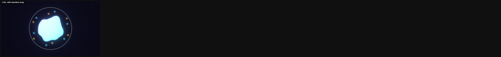

</details>

| id | title | use it for |
|---|---|---|
| `edit-beat-grid` | One grid for picture and sound | decide BPM first (110–128 for modern/tech, 90–100 for calm/Persian 6/8 feel, 140+ for sport/energy), then express every cue as bars/beats: `t =… |
| `edit-structure-15s` | A 15-second structure that works | showreels, social cuts, logo-driven pieces |
| `edit-structure-30s` | A 30-second explainer structure | product/feature explainers |
| `edit-structure-60s` | A 60-second film structure | brand films, product stories, narrated pieces |
| `edit-pacing-curve` | Vary the cut length | every film. Equal cut lengths are what slideshows are made of |
| `edit-rule-of-three` | Threes | lists of benefits, build-ups, jokes, reveals |
| `edit-anticipation-action` | Anticipation → action → follow-through | every object move: it should pull back a little before it launches (anticipation), overshoot its target (`E.outBack`, `K.slam`), then settle… |
| `edit-contrast-scale` | Contrast in scale, speed, colour and sound | when a scene feels flat: increase contrast somewhere, not everywhere |
| `edit-layers-depth` | Foreground, midground, background | any scene: three layers moving at different speeds make 2D feel like space |
| `edit-direction-continuity` | Keep motion direction across cuts | a cut where an object leaves right and the next scene's object enters from the left feels smooth; reversing direction feels like a collision (use… |
| `edit-text-timing` | How long text stays on screen | every piece of on-screen text |
| `edit-sound-picture-sync` | Events for every important visual | the cheapest upgrade: a sound for each visual accent |
| `edit-negative-space` | Leave room | premium/calm styles; any moment that must be read |
| `edit-vertical-adapt` | One film, three aspect ratios | social delivery: render 16:9, 9:16 and 1:1 from the same page (`--w --h`) |
| `edit-seamless-loop` | A loop with no seam (reels, GIFs, backgrounds, end cards) | anything that repeats — a social reel that auto-loops, a background under a long title, a "hold" at the end of a film. A loop that you can not find… |

## graphic

**Graphic — 2D motion-design vocabulary (no 3D, no shaders needed)**


<details><summary>Contact sheet — every recipe of this family at its best frame</summary>

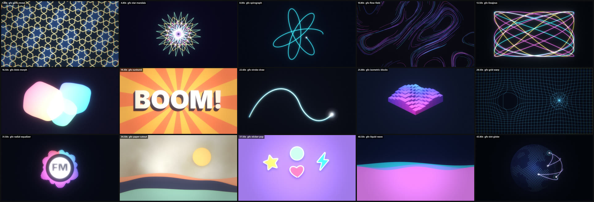

</details>

| id | title | use it for |
|---|---|---|
| `gfx-girih-reveal` | Islamic star pattern grows from the centre | Persian/Islamic visual identity, "knowledge/tradition meets technology" stories, premium backgrounds and end cards; the pattern is mathematically… |
| `gfx-star-mandala` | Counter-rotating star polygons | ornamental centrepieces, loading/"thinking" visuals, logo halos, meditation/intelligence metaphors |
| `gfx-spirograph` | Hypotrochoid curves drawn live | elegant "drawing itself" backgrounds, maths/engineering/art tones, a hypnotic idle animation |
| `gfx-flow-field` | Ink streamlines in a curl-noise wind | generative-art backgrounds, wind/hair/water/fabric metaphors, "data stream" abstractions; calm and expensive-looking |
| `gfx-lissajous` | Lissajous ribbons | oscilloscope/audio/retro-tech looks, "signals", a continuously evolving abstract centrepiece |
| `gfx-blob-morph` | Soft organic blobs | friendly, modern product backgrounds, calm hero scenes, "liquid" brand feels; sits under type without competing |
| `gfx-sunburst` | Pop-art rays behind a hero word | bold/playful/retro-pop styles, "announcement" moments, sale/launch/hero-word beats; rotates slowly, scales with a punch on the hit |
| `gfx-stroke-draw` | A line that draws itself (SVG path draw-on) | arrows/connections, underlines, signatures, route lines, "this leads to that"; one of the most satisfying primitives in motion design |
| `gfx-isometric-blocks` | Isometric block city rising | "building up" stories, data-as-architecture, clean explainer visuals with depth but no 3D engine |
| `gfx-grid-warp` | A grid bent by gravity wells | tech/physics/"attention" backgrounds; a field being disturbed by a moving point (cursor, planet, signal) |
| `gfx-radial-equalizer` | Circular audio bars | music/voice/podcast scenes, logos that "breathe" with sound; with real audio use `K.audioData()` envelopes (see sound.md) instead of noise |
| `gfx-paper-cutout` | Layered paper with soft shadows | handmade/craft/children/storybook tones — the antidote to glossy tech; feels tactile because every layer casts a soft shadow |
| `gfx-sticker-pop` | Sticker pack popping in | playful/social/Gen-Z tones, feature highlights as "stickers", reaction bursts; the white outline + soft shadow is what makes shapes read as stickers |
| `gfx-liquid-wave` | Liquid rising and sloshing | fill-the-screen transitions, loading, "level up", water/ocean/emotion metaphors; a rising wave is also a great wipe because it reveals the next… |
| `gfx-dot-globe` | A dotted globe with glowing arcs between cities | "worldwide", "any language", networks, travel, shipping, social reach — the shape people recognise instantly. Dots make the land without map data,… |

## ideas

**Ideas — concepts, metaphors, hooks and endings (read BEFORE you write brief.md)**

| id | title | use it for |
|---|---|---|
| `idea-metaphor-ladder` | From literal to impossible | whenever the first idea feels like "a product video". Do it on paper in brief.md: three rungs for the main message |
| `idea-signature-object` | One object that transforms through the film | gives 15–60 s a spine without dialogue: the viewer follows ONE thing. Works for showreels, brands, explainers |
| `idea-impossible-camera` | The camera that goes where no camera can | hooks and transitions; most memorable shots in motion design are impossible camera moves |
| `idea-contrast-structure` | Built on one contrast | films under 20 s: a single big contrast is easier to land than a sequence of equally pretty scenes |
| `idea-one-take` | A single continuous camera through every scene | showreels and brand films that should feel expensive and connected; "one gesture, many worlds" |
| `idea-typing-to-world` | A typed line becomes a world | AI/creation/automation stories: the prompt IS the hero. A caret types a sentence; each word spawns its visual (letters flying out, the scene… |
| `idea-zoom-out-reveal` | Start close, zoom out to the truth | surprise reveals ("this tiny thing is part of that giant thing"), scale/community stories |
| `idea-countdown-rhythm` | Accelerating cuts | showreels, trailers, "N things" explainers: the editing itself is the idea |
| `idea-glitch-fix` | Broken, then repaired | problem→solution stories (communication breakdown → clarity): the "problem" is shown as distortion, the product restores it |
| `idea-split-pair` | Two worlds side by side | comparison, translation, dubbing, collaboration, A/B: the frame divides and each half is a world that responds to the other |
| `idea-loop-ending` | The end is the beginning | social-first cuts and logo stings; invites replays; elegant for 8–15 s pieces |
| `meta-translation-language` | Language, translation, dubbing | subjects about speaking across languages (Avorythm-like products, learning apps, subtitles, dubbing, travel) |
| `meta-speed-realtime` | Speed, real time, zero latency | "instant", "live", "zero delay" claims |
| `meta-ai-intelligence` | AI, intelligence, models | AI products. Avoid the cliché blue brain: show *behaviour* (thinking, noticing, choosing) not anatomy |
| `meta-open-source-community` | Open source and community | open-source tools (Avorythm is one): value = many hands, transparency, freedom |
| `meta-privacy-security` | Privacy, security, trust | privacy-first / offline / on-device claims |
| `meta-creation-craft` | Making, craft, the maker's hand | showreels, tools for creators, portfolio films |
| `meta-growth-data` | Growth, data, momentum | traction, results, impact stories |
| `meta-connection-network` | Connection, people, links | social products, platforms, communication, communities |
| `meta-time-memory` | Time, memory, nostalgia | heritage, "years of …", emotional films |
| `meta-transformation` | Transformation and metamorphosis | any "before → after" product benefit |
| `meta-simplicity-clarity` | Simplicity and clarity | "just works", minimal products, calm brands |
| `meta-global-scale` | The world, scale, reach | international reach, "for everyone" |
| `meta-music-sound-rhythm` | Music, sound, rhythm | music, audio, podcast, voice tools, events |
| `meta-showreel-self` | "I make things move" (showreels, portfolios) | résumé/showreel films where the *work is the content* (the first user prompt!). Do not narrate skills — **demonstrate range with one coherent style** |
| `hook-first-two-seconds` | Hooks that stop the scroll | every film: the first 1–2 seconds decide whether anyone watches the next 13 |
| `end-first-last-impression` | Endings people remember | every film: the last 2–3 seconds are what is remembered and shared |

## light

**Light & atmosphere — what makes a frame feel photographed**

<details><summary>Contact sheet — every recipe of this family at its best frame</summary>

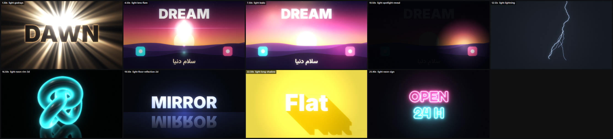

</details>

| id | title | use it for |
|---|---|---|
| `light-godrays` | Backlit title with god-rays | epic/serious title reveals, "dawn" moments, anything that should feel important; a black title silhouette against a radiant source |
| `light-lens-flare` | Anamorphic lens flare with ghosts | a bright light entering frame (sun, headlight, logo reveal glint); sells "camera" instantly. One pass per hero moment — not constantly |
| `light-leaks` | Warm light leaks over footage | warm, organic, nostalgic or hopeful scenes; between-scene accents; a cheap way to make digital graphics feel like film |
| `light-spotlight-reveal` | A searching spotlight | reveal content gradually (mystery, stage, "find the detail"), a lens-of-attention metaphor, noir/thriller or theatrical tone |
| `light-lightning` | Procedural lightning strike | power, shock, "idea!" beats, storm moods, electric transitions, impact of a big reveal |
| `light-neon-rim-3d` | Rim-lit silhouette in the dark | dramatic product/character shots: the object is almost black, defined only by coloured edge light — premium, moody, techy |
| `light-floor-reflection-2d` | Glossy floor reflection (2D) | titles and logos that should look like objects standing on glass; premium/tech feel without 3D |
| `light-long-shadow` | Flat design long shadow | flat/bold graphic styles, icons, sticker-like titles; adds depth without gradients |
| `light-neon-sign` | A neon sign that flickers on | a brand name or a word in a dark room with a retro / night-city / cyber mood. The ON sequence carries the drama — dead, stutter, steady — and the… |

## logos

**Logos & title stings — ten ways to reveal a mark**

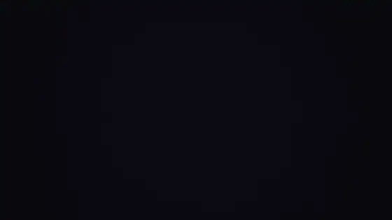

<details><summary>Contact sheet — every recipe of this family at its best frame</summary>

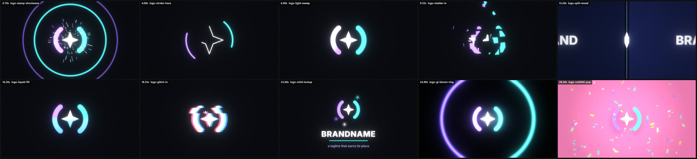

</details>

| id | title | use it for |
|---|---|---|
| `logo-stamp-shockwave` | Slam, ring, sparks, shake | the classic, punchy sting: the mark drops from large, lands with squash, a ring and sparks leave it, the frame shakes. 1.2 s, works for any mark |
| `logo-stroke-trace` | The mark draws itself, then fills | elegant/technical brands; the line draws, the fill fades in, a glint passes. Best for marks built from clean geometry |
| `logo-light-sweep` | A glint of light crosses the mark | premium, calm brands; after the mark has appeared, a soft diagonal band of light passes over it ONLY where the mark is — the finishing touch of most… |
| `logo-shatter-in` | Shards converge and lock | tech/energetic brands; the inverse of an explosion: dozens of tiles fly in from everywhere with spin, scale and stagger, lock into the mark, a flash… |
| `logo-split-reveal` | Two halves slide apart | corporate/clean intros, "opening" metaphors (doors, curtains, a book), a transition INTO the brand scene |
| `logo-liquid-fill` | Liquid rises inside the mark | loading → brand ("charging up"), water/drink/energy/wellness brands, progress metaphors. The silhouette is the container |
| `logo-glitch-in` | Slices and RGB split settle into the mark | cyber/tech/gaming/security brands, "signal found" stories; 0.6 s of corruption that resolves into a clean mark on the hit |
| `logo-orbit-lockup` | Mark + wordmark lock-up with orbiting accents | the end card of almost any film: mark above, name below, a tagline, small accents that keep moving so the hold never goes dead |
| `logo-gl-bloom-ring` | The mark inside a growing light ring (GPU) | cinematic stings: a thin ring of light expands from the centre as the mark fades up, anamorphic streaks ride the bloom; works in dark scenes with a… |
| `logo-confetti-pop` | Playful pop with confetti | friendly/consumer/kids/social brands; bouncy spring scale (`K.spring`), confetti cannons, a wobble on settle |

## looks

**Looks — the filter and grade that give a film its identity**

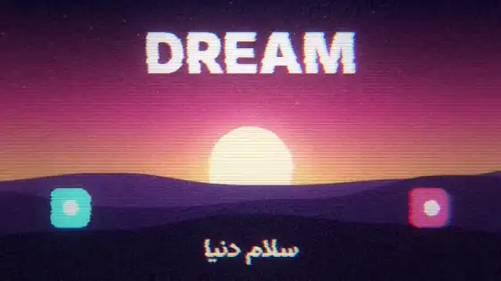

<details><summary>Contact sheet — every recipe of this family at its best frame</summary>

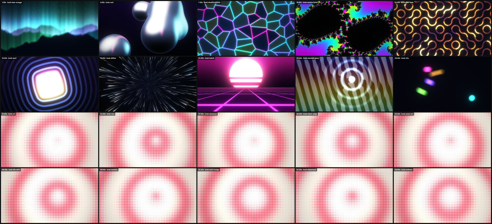

</details>

| id | title | use it for |
|---|---|---|
| `look-teal-orange` | Cinematic grade | the default "expensive" finish for realistic/3D/city/product scenes; warm highlights, cool shadows, a touch more contrast |
| `look-noir` | Black & white contrast | serious/dramatic/historical beats, a "memory" scene, a contrast cut against colour scenes |
| `look-dream-bloom` | Soft, glowing, lifted blacks | dreamlike, romantic, nostalgic, "memory", fantasy; the visual opposite of noir |
| `look-anamorphic` | Widescreen lens streaks | trailers, sci-fi, night cities, any scene with bright lights; pair with `Cine.letterbox` bars (2.39:1) |
| `look-film-fade` | Faded vintage film | nostalgia, archive footage, "years ago", retro-pop; soft and warm |
| `look-ascii` | The picture becomes characters | "the machine's view", code/AI/matrix tones, a hard stylistic cut, turning any scene (3D, particles, UI) into text art; very strong signature technique |
| `look-dither` | 1-bit bitmap | retro-computing, poster/print texture, "low-fi" interludes, a bold cut away from smooth gradients |
| `look-hatch` | Engraving / crosshatch drawing | "hand-drawn" feel, history/science/editorial tones, a drawn-by-pen interlude |
| `look-stained-glass` | Voronoi mosaic | cathedral/crystal/low-poly looks, "fragments", shatter-in transitions (animate `cells` from 80 down to 10) |
| `look-vhs` | VHS tape | found-footage, 80s/90s nostalgia, "recording", flashbacks; short bursts (0.3–0.8 s) are better than a whole film |
| `look-crt` | Old monitor | "on a screen" scenes (terminal, game, old TV), tech-nostalgia; the quick way to make UI look physical |
| `look-riso` | Two-ink print / risograph | graphic/poster/editorial/pop styles; the opposite of "realistic 3D"; strong with flat colours and big type |
| `look-duotone` | Gradient map | force any footage into the brand palette; unify clashing scenes; instant stylisation (3 colours: shadows, mids, highlights) |
| `look-neon-edge` | Glowing outlines | Tron/cyber/blueprint looks; turns any flat-shaded scene into glowing line art; great on 3D renders and logos |
| `look-pixel-art` | Chunky pixels | game/retro scenes, "loading", censorship-style reveals (animate `size` 64 → 1 for a pixel-in reveal) |
| `look-tilt-shift` | Miniature world | aerial/city/landscape shots that should look like toys; a playful change of scale |
| `look-kaleido` | Kaleidoscope mandala | ornamental/psychedelic/Persian-pattern feeling from ANY source; transitions ("everything folds into a pattern"); spinning logo backgrounds |
| `look-swirl-bulge` | Distortion toys | playful transitions and emphasis (magnify a detail, twirl away), "drain" effects, hypnotic intros |
| `look-datamosh` | Compression-glitch blocks | errors, transitions into chaos, "signal" beats; trigger for 3–8 frames on hits, not continuously |
| `look-emboss` | Relief lighting | engraved-metal / paper-cut / coin looks from flat artwork; subtle tactility on UI |

## particles

**Particles — tens of thousands of points, closed-form, deterministic**

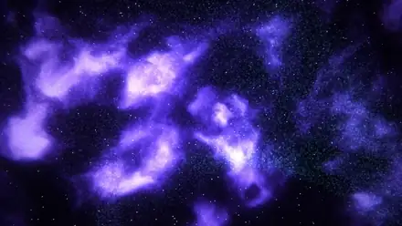

<details><summary>Contact sheet — every recipe of this family at its best frame</summary>

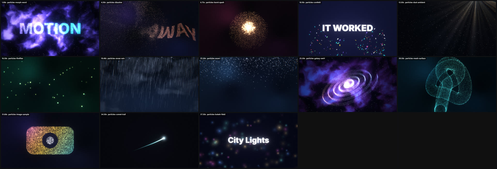

</details>

| id | title | use it for |
|---|---|---|
| `particles-morph-word` | Smoke becomes a word, then another word, then an object | brand/logo reveals, "chaos → order" metaphors, translating one word into another (English → Persian is the perfect demo of this engine) |
| `particles-dissolve` | A word disintegrates into dust | exits and transitions ("it all dissolves into the next scene"), emotional endings, the Thanos snap |
| `particles-burst-spark` | Explosion of sparks | the loud beat (logo hit, drop, "boom"), cut on impact, anything that needs a physical exclamation mark |
| `particles-confetti` | Confetti cannons (true colours) | wins, launches, "it worked", birthdays, the end of an explainer's happy path |
| `particles-dust-ambient` | Floating dust in light shafts | depth and air behind almost any scene; makes a static background feel photographed; hero/product/quiet moments |
| `particles-fireflies` | Slow glowing fireflies | dreamy night scenes, "magic", forests, a gentle loop under a title |
| `particles-snow-rain` | Snow, rain, falling things | mood weather, winter/rainy tones, "falling" metaphors (data, letters, stars); rain = long motion-blur streaks, snow = soft slow dots |
| `particles-snow` | Soft falling snow with drift | winter/quiet/emotional moods, "falling" letters or stars, a soft layer over a night-blue gradient or a 3D scene |
| `particles-galaxy-swirl` | A spiral galaxy of points | openers and transitions in space/AI/"universe of data" stories; rotating logo-like object made of light |
| `particles-mesh-surface` | A 3D object made of light points | tech/hologram/scan looks, "data object", a model that should feel digital; reveal by morphing from a cloud |
| `particles-image-sample` | Any picture as coloured particles | a multi-coloured logo/icon/illustration built from light; "pixel" reveals; turning a drawing into a living object |
| `particles-comet-trail` | A glowing comet with a tapering trail (2D) | guiding the eye along a path (from A to B), "signal travels", loading arcs, drawing a connection between two nodes |
| `particles-bokeh-field` | Soft bokeh lights (2D, cheap) | a cheap, always-pretty background for titles, lower thirds and end cards; "city lights out of focus" |

## pipelines

**Pipelines — the glue patterns that make a film feel like one piece**

| id | title | use it for |
|---|---|---|
| `pipe-global-atmosphere` | One foreground layer over every scene | ambient dust/bokeh/sparks that drift across ALL scenes (including during transitions) so the film has one consistent air; the cheapest way to lift… |
| `pipe-camera-per-scene` | A different slow move for every scene | gives every scene its own camera gesture (push, pull-out, drift, roll) without hand-animating each draw function; the single biggest cure for… |
| `pipe-2d-through-filter` | Run any 2D scene through a shader filter | a scene drawn with canvas 2D that should look like VHS (the "problem" scene), ASCII (the machine's view), a mosaic (shatter-in), a CRT… without… |
| `pipe-logo-cutout` | A PNG logo on white becomes a transparent mark (and particles) | the client's logo exists only as a PNG on white; you need it on dark backgrounds, glowing, and dissolving into particles |
| `pipe-3d-pin-2d` | Pin 2D beams and labels to a point on a 3D object | callouts, laser beams, sound waves entering/leaving a 3D object, HUD labels that follow a rotating model; the engine's depth ordering is 3D-only, so… |
| `pipe-procedural-footage` | Fake "video" for UI scenes, drawn in code | a UI scene needs moving picture inside a player/browser/phone and you have no footage: generate it — a night sky with aurora ribbons, a moon,… |
| `pipe-cue-events` | Name every sound-and-picture event in the cues | any moment where the picture and the soundtrack must meet exactly — a click, a label pop-in, a logo chime. Hard-coded seconds drift apart the moment… |
| `pipe-direction-theme` | Left/right as meaning (bilingual films) | films about translation, two languages, two parties, before/after — give each side a colour and a direction and let EVERY scene be a negotiation… |

## shaders

**Shaders — backgrounds you can name, and GLSL you can write in ten lines**

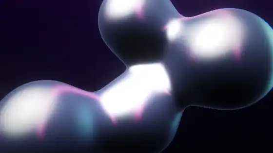

<details><summary>Contact sheet — every recipe of this family at its best frame</summary>

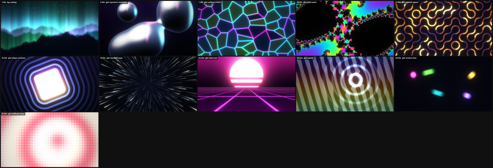

</details>

| id | title | use it for |
|---|---|---|
| `bg-catalog` | The 25 built-in backgrounds | choose a mood in one line; every scene needs a background that is not flat black. `FX.bgs` lists names, `FX.info(name).desc` says what the four… |
| `glsl-raymarch-metaballs` | Liquid metal blobs (raymarched SDF) | an abstract hero object with no mesh: merging liquid-metal blobs; "fluid", "alive", "melting" ideas; backgrounds behind a title |
| `glsl-voronoi-cracks` | Glowing cell borders | "network", "cells", glass shatter, cracked earth/lava, a restless tech background |
| `glsl-julia-zoom` | Endless fractal zoom | psychedelic/"infinite" transitions, science/maths tone, a hypnotic loop under a title. Smooth colouring (no banding) is what makes it look expensive |
| `glsl-truchet-weave` | Woven arcs that flip | a graphic, rhythmic background; maze/flow/"connections" metaphors; Islamic-inspired interlace feel without heavy geometry |
| `glsl-shape-contours` | Morphing SDF shape with ripple contours | calm abstract graphics, logo-adjacent backgrounds, "pulse/ripple" under a title, an elegant way to morph circle → square → star |
| `glsl-starfield-warp` | Hyperspace star streaks | speed ramps, transitions into "the future", scene changes in sci-fi/tech tones, loading screens that aren't boring |
| `glsl-retro-sun` | Striped sun over a perspective grid | 80s/synthwave/music tones, "going somewhere", a ready-made hero background that needs only a title over it |
| `glsl-ripples` | Water rings that bend a pattern | a drop/tap/click moment, "signal spreads", sound waves, calm product backgrounds; the ripples also distort whatever you draw under them (use the… |
| `glsl-motion-blur` | Closed-form motion blur by sampling time | ANY fast-moving shader/graphic: instead of feedback buffers (forbidden: frames are independent), evaluate the scene at N times inside the shutter… |
| `glsl-halftone-wave` | Pop-art halftone dots | playful/graphic/print looks (riso, comic, poster), a bold light background that is not another dark gradient |

## sound

**Sound — the half of the film people feel before they see it**

| id | title | use it for |
|---|---|---|
| `sfx-hit-stack` | The logo hit (layers that make a hit feel big) | the loudest moment of the film: a logo/word landing, the "drop", the reveal. A single `impact` is thin — stack: riser → silence → impact + sub +… |
| `sfx-ui-sounds` | Tick, pop, type, swipe, success, error | every interface moment: cursor clicks, typing, toasts, toggles, results. Sync each to the exact frame of the visual (read the time from the same cue) |
| `sfx-whoosh-set` | Whooshes for cuts and moves | under every fast move and transition (whip, slide, zoom): start the whoosh ~0.3 s BEFORE the cut so its peak lands on it |
| `sfx-riser-drop` | Build, silence, drop | the structure of almost every good 15–30 s video: 2–4 s of rising tension, 0.1–0.3 s of near-silence, then the drop (groove + hit) |
| `sfx-glitch-stutter` | Digital glitch and zaps | under glitch transitions, data/hacker moments, "system" beats; short bursts (0.15–0.4 s) at cut points |
| `sfx-heartbeat-tension` | Low tension bed | suspense, "something is about to happen", emotional or serious moments; the opposite of a groove |
| `beat-house-groove` | Four-on-the-floor with sidechain | confident, forward-moving product/tech/launch films at 120–128 BPM; the default "modern" energy |
| `beat-trap-halftime` | 140 BPM half-time with 808 sub | urban/modern/streetwear/sport reels; heavy sub, snappy rolling hi-hats, snare on beat 3 |
| `beat-dnb-breaks` | Drum & bass / breakbeat energy | fast cuts, chase/race/"speed" themes, high-energy montages (170 BPM feel at tempo 170; here 120 BPM breakbeat) |
| `beat-lofi-chill` | Lo-fi keys and vinyl | calm, friendly, "everyday" or reflective films at 70–90 BPM; a warm bed under voice-over |
| `beat-persian-sixeight` | Persian-flavoured 6/8 (tombak + daf + santur + ney) | films for Persian audiences or any film that should feel Iranian/Middle-Eastern: celebrations, heritage + technology, Nowruz-like warmth. An… |
| `persian-santur-melody` | A Shur phrase on santur with ney drone | a lyrical Persian theme: openers, emotional beats, endings. Quarter-tones give the character: `'Ed4'` = E lowered by a quarter tone (koron), `'E+4'`… |
| `pad-cinematic-swell` | Strings and pad swell | openers, emotional beats, quiet-to-loud arcs; the sound of "something important is beginning" |
| `arp-synthwave` | Saw arps with delay | neon/retro/night-city/tech scenes; a forward-moving melodic bed with echo |
| `outro-resolve` | Resolution with bell shimmer | the last 3 seconds: the chord resolves to major/open, bells shimmer, everything rings out into reverb — a sound people remember as "the end" |
| `ambience-wind-air` | Atmosphere beds | under quiet establishing shots, nature/space/meditative films; fills silence with life so the mix never goes dead |
| `voice-babble` | Stand-in speech for talking scenes | a "person talking" bed when you have no voice-over (translation/dubbing demos: one babble in a dull timbre for the original, a brighter one for the… |

## styles

**Styles — complete visual systems (pick ONE per film, then commit)**

| id | title | use it for |
|---|---|---|
| `style-chrome-cinema` | Dark cinematic chrome | product/brand/tech films that should feel expensive and powerful; the cinema template |
| `style-neon-synth` | Neon night / synthwave | music, gaming, nightlife, crypto/tech with attitude |
| `style-clean-product` | Soft, white, precise product film | SaaS/app/hardware explainers, "it just works", calm confidence |
| `style-brutalist-poster` | Loud typographic poster | sport, fashion, events, youth brands, anything that should shout |
| `style-swiss-grid` | Swiss / Bauhaus geometry | design studios, architecture, education, data stories, serious-but-fresh brands |
| `style-riso-print` | Risograph / halftone print | indie, culture, music posters, education, "human" brands; a tactile alternative to glossy 3D |
| `style-paper-craft` | Layered paper & collage | stories, education, kids, wellness, food — warm and human |
| `style-clay-3d` | Soft clay 3D | friendly tech, apps for everyone, kids, onboarding; "3D but approachable" |
| `style-liquid-dream` | Liquid metal & dreamy gradients | AI, creativity, fashion, wellness tech; surreal and calm at once |
| `style-terminal-hacker` | Terminal / ASCII / code | developer tools, security, open source, "under the hood" views of AI |
| `style-holo-blueprint` | Hologram & technical drawing | engineering, science, infrastructure, AI "analysis" scenes, aerospace |
| `style-dark-glass-ui` | Dark glass dashboards | SaaS, fintech, dev platforms, dashboards, feature launches |
| `style-persian-heritage` | Persian ornament & light | Persian-language audiences, cultural/heritage/literary subjects, premium regional brands, any film that should feel unmistakably Iranian without… |
| `style-vhs-retro` | VHS / analog nostalgia | nostalgia, culture, music, "memories", behind-the-scenes looks |
| `style-playful-sticker` | Playful stickers & pop | consumer apps, social, kids, campaigns for young audiences |
| `style-noir-editorial` | Black & white editorial | serious subjects, documentary, journalism, luxury/heritage with restraint |
| `style-space-epic` | Space & cosmic scale | science, AI "intelligence", big ideas, global scale, inspirational films |
| `style-data-city` | Data as architecture | reports, growth stories, analytics, civic/finance explainers |
| `style-ink-calligraphy` | Ink, brush and flow | poetry, culture, mindfulness, craft, arts; very Persian-friendly with Nastaliq/Ruqaa |
| `style-glitch-cyber` | Aggressive glitch | security, techno, gaming, rebellious brands, "system failure" stories |
| `style-sunset-lofi` | Warm sunset lo-fi | lifestyle, community, friendly brands, wellness, "good vibes" |
| `style-kinetic-type-only` | Type is the whole film | statements, manifestos, quotes, lyric videos, tight budgets where the idea is the words |

## three-d

**3D — a real-time engine, no assets, any script (Scene3D)**

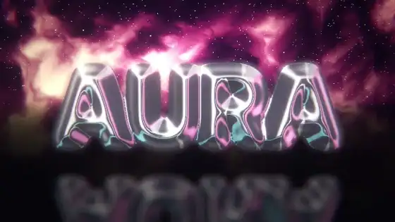

<details><summary>Contact sheet — every recipe of this family at its best frame</summary>

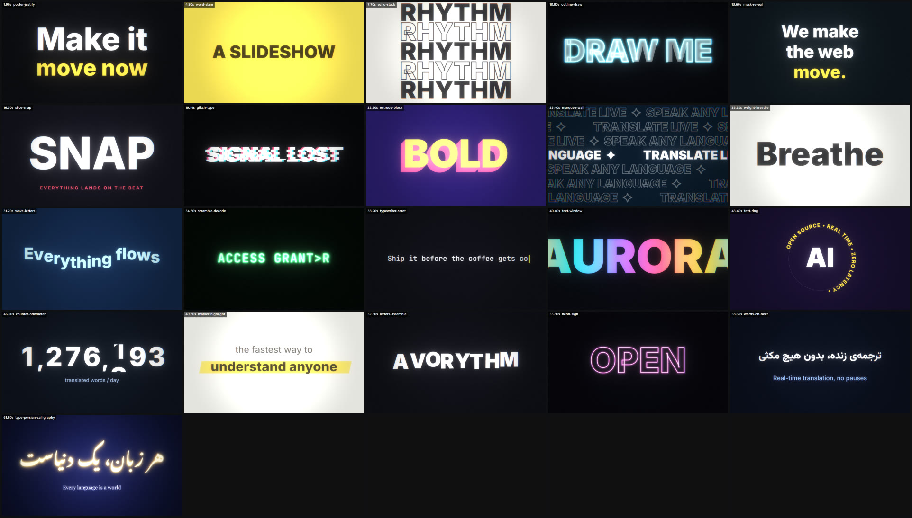

</details>

| id | title | use it for |
|---|---|---|
| `text3d-chrome` | Puffy chrome word on a glossy floor | THE hero shot — brand name / title as a polished 3D object; opening or end card; works for Persian (`Geo.text('سلام')`) |
| `glass-gems` | Faceted glass jewels refracting the sky | premium/luxury, "clarity", crystals, abstract hero objects, end-card ornaments |
| `material-wall` | A palette of materials | showing "range", a brand-material moodboard, choosing a look; a rotating nine-ball shot is also a strong abstract hero |
| `city-night-flight` | Neon city fly-through | tech/scale/ambition beats, "the world", a travelling scene between two ideas; the single most cinematic 3D shot you can get cheaply |
| `terrain-synthwave` | Wireframe terrain under a low sun | retro-future, music, "journey", data landscapes; wireframe = abstract and cheap, no textures needed |
| `orbit-rings` | Hero orb with orbiting rings | a "system" or "platform" metaphor, loading/processing, planet/atom look, background for a title |
| `tunnel-rings` | Fly through a tunnel of glowing rings | speed, transition between sections, "going deeper", music drops, loading → reveal |
| `helix-ribbon` | Twisting tube ribbons (DNA / data helix) | biology/data/flow metaphors, abstract hero, "two things intertwined" (two languages, two people) |
| `relief-logo` | Any 2D drawing becomes a 3D object | turn a logo/glyph/icon into a metal object without a 3D model; seals, coins, emblems; end cards |
| `phone-ui-3d` | A live 2D interface mapped onto a 3D device | app demos with a camera move (the 2D UI stays pixel-perfect and animated while the phone tilts/orbits); "feature" shots |
| `planet-atmosphere` | Planet with glowing atmosphere and moon | scale, "global" ideas (translation between countries!), science/space, night-sky openers |
| `cubes-wave` | A grid of blocks rippling | rhythm/data/"many voices" metaphors, beat-synced backgrounds (drive the wave with hits), abstract skylines |
| `lowpoly-forest` | Faceted pastel forest in fog | calm, nature, "peaceful", children/indie tones; a dreamy alternative to neon cities |
| `product-pedestal` | Product turntable on a pedestal | product reveals, "the thing itself" shots, trophies/vases/bottles; `Geo.lathe` turns a 2D profile into a bottle, vase, chess piece, lamp |
| `wire-hologram` | Holographic wireframe object | sci-fi interfaces, "analysis", blueprint/AI/network tones, anything that should feel digital rather than physical |

## transitions

**Transitions — how one scene becomes the next**

<details><summary>Contact sheet — every recipe of this family at its best frame</summary>

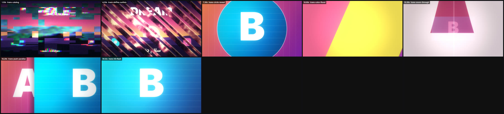

</details>

| id | title | use it for |
|---|---|---|
| `trans-catalog` | The 32 GPU transitions (what each one means) | pick by meaning — energetic: whip · zoomBlurCut · zoom · spin · slide · glitch · flash · scan · slice  /  graphic: iris · diamond · clock · spiral ·… |
| `trans-define-custom` | Write your own transition in 5 lines | when none of the 32 says what you mean — a brand-shaped wipe, diagonal stripes, a logo-shaped iris. Your transition then works in Stage (`enter:… |
| `trans-circle-reveal` | Circle reveal / match cut (2D) | a shape in scene A *becomes* scene B (a sun, a button, an eye, a logo dot grows into the next scene) — the match cut, the most elegant way to change… |
| `trans-color-flood` | Coloured panels sweep through (2D) | bold, graphic, brand-coloured cuts (explainers, social, motion-design reels); the panel colours should come from the palette |
| `trans-zoom-through` | Fall into A, emerge from B (2D) | "going deeper", entering a screen/world, tech and dream tones; pairs with a whoosh and a hit |
| `trans-push-parallax` | Push with parallax and shadow (2D) | UI/explainer tone, calm and clear ("next step"), carousels; the depth cue (A moves slower, B casts a shadow) makes it feel like layers instead of a… |
| `trans-hit-flash` | Flash + shake + split on a hit (2D) | the cut that lands on a drum hit; logo slams; section starts of a track. Most "pro" cuts are this: a 3–5 frame accent, not a long effect |

## type

**Typography — kinetic type that carries the message**

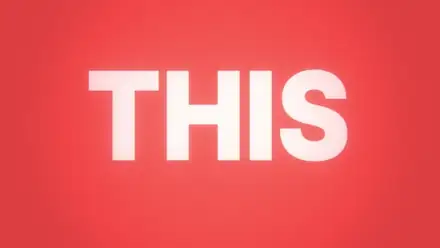

<details><summary>Contact sheet — every recipe of this family at its best frame</summary>

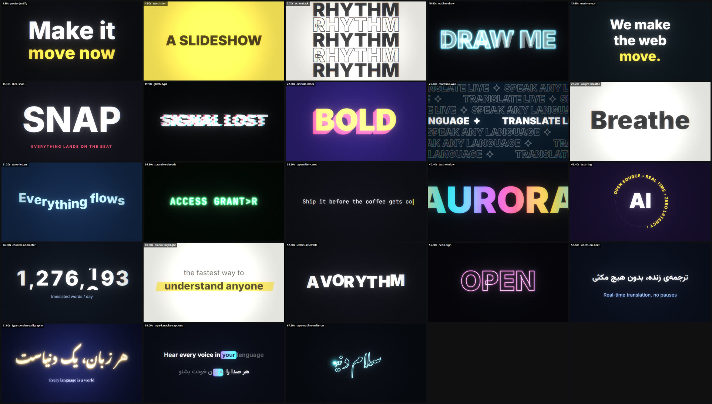

</details>

| id | title | use it for |
|---|---|---|
| `poster-justify` | Justified word poster | the big statement; a tagline that fills the frame; "headline" beats of 1.5–3 s |
| `word-slam` | One word per beat, slammed in | hook sequences ("THIS. IS. NOT. A SLIDESHOW."), lyric-video energy, countdowns |
| `echo-stack` | Echo stack (solid / outline / solid …) | a single powerful word, music-poster look ("RHYTHM RHYTHM RHYTHM"), section titles |
| `outline-draw` | Letters write themselves | logo/word reveals with a "drawn" feel; titles on dark backgrounds; before the fill-in flash |
| `mask-reveal` | Lines rise out of invisible masks | elegant multi-line statements, subtitles, product feature lines |
| `slice-snap` | Slices fly in and snap together | aggressive title reveals, tech/gaming/sport tone, the beat right after a hit |
| `glitch-type` | RGB split + slice jitter | tension, error states, "signal lost", the cut into a hard scene; pulse `amt` on hits only |
| `extrude-block` | Faux-3D block letters | playful, sticker/poster tone, sport, kids, retro-pop. For real 3D use `text3d-chrome` instead. |
| `marquee-wall` | Counter-scrolling ticker rows | energetic backgrounds behind a hero element, "brand wall", section dividers, fast-cut texture |
| `weight-breathe` | Variable-font weight animation | calm/premium moods, "alive" idle text, emphasis without moving the layout much |
| `wave-letters` | Per-letter sine wave | friendly/joyful tone, "flow" words (translate, music, ocean); a bridge between two statements |
| `scramble-decode` | Decode / hacker reveal | "access granted", loading → result, tech/security tone, translating gibberish into meaning (a perfect Avorythm-style metaphor) |
| `typewriter-caret` | Typed line with blinking caret | quiet, human moments; chat/code/search-box scenes; punchline after silence |
| `text-window` | Letters as a window onto anything | a huge word filled with moving colour, a shader frame, a photo or video; the "title over nothing" look |
| `text-ring` | Text around a circle | rotating badges/seals, "sticker" accents, logo lock-ups, a decorative spinning ring around a hero |
| `counter-odometer` | Rolling number counter | stats ("12M users"), prices, progress, countdowns; the most convincing "numbers going up" move |
| `marker-highlight` | Highlighter sweep | emphasising one phrase inside an explainer; "this is the part that matters" |
| `letters-assemble` | Letters fly in and snap together | logo/name reveal with energy, "everything comes together" metaphors, end cards |
| `neon-sign` | Flickering neon tube text | nightlife/synthwave/cyber tones, "open" signs, a title that needs a warm electric glow |
| `words-on-beat` | Lyric-style words (Persian-safe) | subtitles with presence, voice-over line reveals, lyric/explainer lines |
| `type-font-guide` | Twelve bundled fonts and what each is for | pick fonts BEFORE designing — type choice is half of a style system. Specimen: `references/gallery/fonts.jpg` / `examples/fonts.html` |
| `type-persian-calligraphy` | Poetic Persian title (Nastaliq) with a quiet gold glow | heritage/poetry/literary tones, openers and end cards for Persian audiences; a refined contrast to techy sans type. Pair with `gfx-girih-reveal` or… |
| `type-karaoke-captions` | Word-by-word highlighted captions (Persian-safe) | subtitles that are part of the design — dubbing/translation products, lyric videos, spoken explainers. The active word lights up, the others wait, a… |
| `type-outline-write-on` | Text that writes itself (outline, pen glow, then fill) | elegant titles, poetry in Nastaliq, a signature or brand name — a glowing pen head travels along the word, leaving a thin outline that turns into… |

## ui-data

**UI & data — interfaces, numbers and charts that look designed**

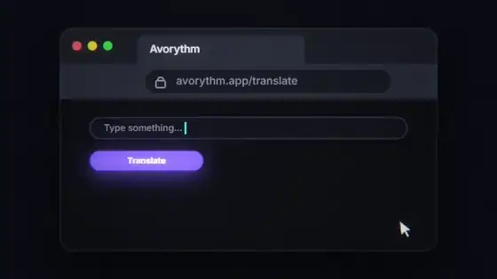

<details><summary>Contact sheet — every recipe of this family at its best frame</summary>

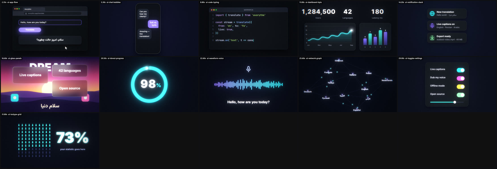

</details>

| id | title | use it for |
|---|---|---|
| `ui-app-flow` | Type, click, result (with a real cursor) | the core of any product explainer: "paste text → press Translate → result appears"; shows the product doing its job in 4 seconds |
| `ui-chat-bubbles` | Conversation with typing dots | communication products, social proof, "two people, two languages" (mix Persian and English bubbles); the typing indicator builds anticipation |
| `ui-code-typing` | Code being typed with syntax colours | developer/open-source/API stories ("it's just three lines"), tutorials; makes abstract capabilities concrete |
| `ui-dashboard-kpis` | KPIs, line chart and bars | growth/metrics stories, "it works" evidence; three numbers + one chart is the whole language of data in 4 seconds |
| `ui-notification-stack` | Toasts sliding in | "things happening in real time" (messages, payments, translations arriving), social-proof moments, phone lock-screen looks |
| `ui-glass-panels` | Frosted glass cards over a living background | modern, premium UI looks; floating cards over a colourful shader background; feature grids |
| `ui-donut-progress` | Ring progress with a big number | "98 % accuracy", loading/processing, shares, completion; a ring + number is instantly readable |
| `ui-waveform-voice` | Voice waveform → text | any story about voice, speech, music, dubbing, podcasts; the waveform is the universal "sound" glyph; here it turns into subtitle text (voice → words) |
| `ui-network-graph` | Nodes, links and travelling signals | "everything is connected", communities, languages, servers, supply chains; signals travelling along edges read as live data |
| `ui-toggles-settings` | Switches and sliders flipping | "customise everything", feature lists as live controls, privacy/settings stories; each toggle flips on a beat for rhythm |
| `ui-isotype-grid` | "73 of 100": a grid of people that fills to a statistic | ONE statistic that must be felt, not read — "7 of 10 …", "1 in 4 …". The grid makes the number physical; the counter and one headline do the rest.… |

