# Benchmark: each agent against itself

<!-- GENERATED by benchmark/report.mjs from benchmark/results/**/summary.json — do not edit by hand. -->

Claims about creative tools are cheap, so this repository ships the means to **measure** them: a runner that gives a coding agent (the Codex CLI by default) the *same prompt* in a fresh folder with and without the skill, and objective metrics computed from the finished MP4. Every agent is compared with **itself** — Codex with Codex + Cinewright, Claude with Claude + Cinewright — never with another agent. See [`benchmark/README.md`](../benchmark/README.md) to run it yourself.

**How to read the numbers.** They detect the classic failures of agent-made video — a slideshow, thin lines on empty black, a flat soundtrack — they do not judge beauty. For beauty, watch the films on the [website](https://msmahdinejad.github.io/cinewright/#results) (with sound) and use the blind rating tool (`node benchmark/rate.mjs`).

| metric | meaning | better |
|---|---|---|
| frame fill % | median share of each frame that is not background (`qc.mjs look`): thin lines on empty black score under 10, full-bleed posters 30–55 | higher |
| static % | share of the film where almost nothing changes frame-to-frame (`qc.mjs energy`) | lower |
| longest static | the longest stretch with almost no change, seconds | lower |
| LUFS / LRA | loudness (social target ≈ −14) and loudness range (mix dynamics; under 1 LU is flat) | −14 / higher |
| craft | `qc.mjs craft` failures/warnings on the project (only projects with the skill's structure) | 0 / 0 |
| brief · reviews | a written brief.md and the number of `qc/review-N.md` rounds found in the project | yes · 3 |
| wall · tokens | agent wall-clock time and input+output tokens (Codex JSONL) | – |

## Headline: the showreel prompt, with and without the skill

> `$cinewright make a dynamic 15-second motion graphics video that shows what an incredible motion designer you are, like it's your showreel for a résumé. Go all out.`
>
> The baseline gets exactly the same text without `$cinewright` (and the skill is disabled). Same footer for both: *deliver ./final.mp4 with sound*. Codex: `codex exec`, reasoning effort **xhigh**, unattended. Claude: an interactive session (not blind — see the note).

### Codex · gpt-6-astra · xhigh reasoning

| run | film | frame fill % ↑ | static % ↓ | longest static | LUFS / LRA | craft fail/warn | brief · reviews | wall · tokens |
|---|---|---:|---:|---:|---|---|---|---|
| Codex gpt-6-astra, no skill | 15.0 s · 1920×1080 | 25 | 25 | 2.5 s | -14 / 0.2 | – | no · 0 | 29 min · 1.6M |
| Codex gpt-6-astra + Cinewright | 15.0 s · 1920×1080 | 30 | 11 | 1.5 s | -14.1 / 1.2 | 0/0 | yes · 3 | 34 min · 9.1M |

*Reading (skill minus no-skill):* frame fill +5 pts · static time -14 pts · loudness range +1 LU · 5.5× the tokens · 1.2× the time.

Codex gpt-6-astra, no skill — contact sheet

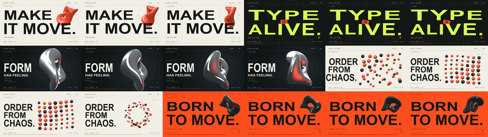

Codex gpt-6-astra + Cinewright — contact sheet

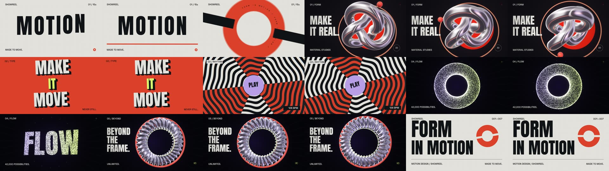

### Codex · gpt-6.1-sol · xhigh reasoning

| run | film | frame fill % ↑ | static % ↓ | longest static | LUFS / LRA | craft fail/warn | brief · reviews | wall · tokens |
|---|---|---:|---:|---:|---|---|---|---|
| Codex gpt-6.1-sol, no skill | 15.0 s · 1920×1080 | 30 | 11 | 1.5 s | -14.1 / 1.4 | – | no · 0 | 25 min · 1.9M |
| Codex gpt-6.1-sol + Cinewright | 15.0 s · 1920×1080 | 30 | 14 | 0 s | -14.1 / 2.3 | 0/0 | yes · 3 | 65 min · 13.8M |

*Reading (skill minus no-skill):* frame fill +0 pts · static time +3 pts · loudness range +0.9 LU · 7.4× the tokens · 2.6× the time. **The skill film has more static time.**

Codex gpt-6.1-sol, no skill — contact sheet

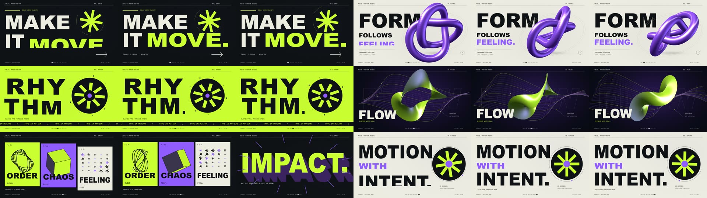

Codex gpt-6.1-sol + Cinewright — contact sheet

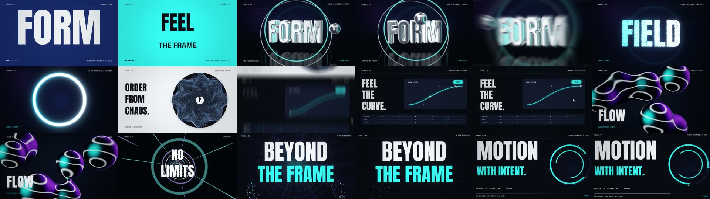

### Claude Code · Sonnet 5.5 (interactive)

| run | film | frame fill % ↑ | static % ↓ | longest static | LUFS / LRA | craft fail/warn | brief · reviews | wall · tokens |
|---|---|---:|---:|---:|---|---|---|---|
| Claude Code (Sonnet 5.5), no skill | 15.0 s · 1280×720 | 16 | 21 | 0 s | -17.1 / 2 | – | – | – · – |
| Claude Code (Sonnet 5.5) + Cinewright | 15.0 s · 1920×1080 | 48 | 0 | 0 s | -14 / 1.9 | 0/0 | yes · 3 | – · – |

*Reading (skill minus no-skill):* frame fill +32 pts · static time -21 pts · loudness range -0.1 LU.

Claude Code (Sonnet 5.5), no skill — contact sheet

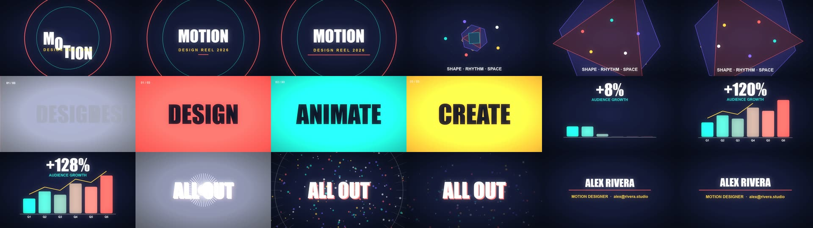

Claude Code (Sonnet 5.5) + Cinewright — contact sheet

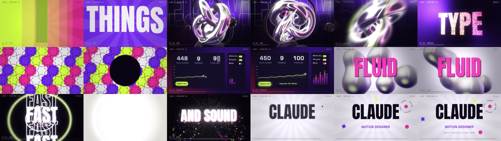

- **Claude Code (Sonnet 5.5), no skill:** Made in an interactive session, not an unattended run: the same Claude session that made the with-skill film, so it is not blind. It did NOT open or use the skill — plain Python + Pillow + numpy + ffmpeg, two passes (a first draft, then one polish pass after looking at stills), about 30 minutes. The generator script is committed next to this summary.
- **Claude Code (Sonnet 5.5) + Cinewright:** Made in an interactive session following the skill's protocol (fork the showreel template, brief.md, look-dev, three written review rounds, the QC gate), about 25 minutes of work including four renders; not blind. The project folder (brief.md, video.html, audio.mjs, qc/review-1..3.md) is committed as a case study.

## Real motion graphics, with and without the skill (second pass)

The same four everyday jobs — introduce a person, a channel intro, a vertical social promo, an animated infographic — but the prompts now say what the first pass taught us to ask for: *real motion design, not a slideshow — objects and type travel and transform from one scene into the next, the camera moves, every cut lands on the beat* ([`benchmark/suite/motion.json`](../benchmark/suite/motion.json)). Both conditions get the same text. The with-skill runs use the redesigned skill (shots instead of slides, a carried object, travelling transitions, a routing table that sends everyday jobs to the motion kit). **Every complete pair we ran is listed.**

### Introduce a person — Codex · gpt-6-astra · xhigh reasoning

> Make a 15-second motion graphics video that introduces a person: Maya Chen, a senior product designer from Toronto (invent the details). Show her name and role, three skills, three numbers (years of experience, projects shipped, awards) and a short quote, and end on her handle @mayachen. Clean, modern, energetic — the kind of intro a personal brand would open a talk or a portfolio with. It has to feel like real motion design, not a slideshow: objects and type travel and transform from one scene into the next, the camera moves, and every cut lands on the beat. Original music and sound design. Go all out.

| run | film | frame fill % ↑ | static % ↓ | longest static | LUFS / LRA | craft fail/warn | brief · reviews | wall · tokens |
|---|---|---:|---:|---:|---|---|---|---|
| Codex gpt-6-astra, no skill | 15.0 s · 1920×1080 | 12 | 54 | 2 s | -14.2 / 0.5 | – | no · 0 | 61 min · 3.0M |
| Codex gpt-6-astra + Cinewright | 15.0 s · 1920×1080 | 25 | 0 | 0 s | -14.1 / 1.8 | 0/0 | yes · 3 | 64 min · 10.2M |

*Reading (skill minus no-skill):* frame fill +13 pts · static time -54 pts · loudness range +1.3 LU · 3.4× the tokens · 1.1× the time.

Codex gpt-6-astra, no skill — contact sheet

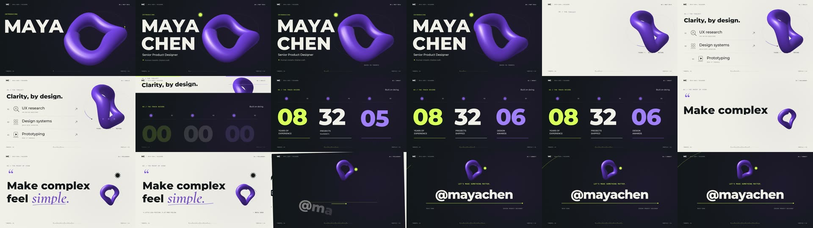

Codex gpt-6-astra + Cinewright — contact sheet

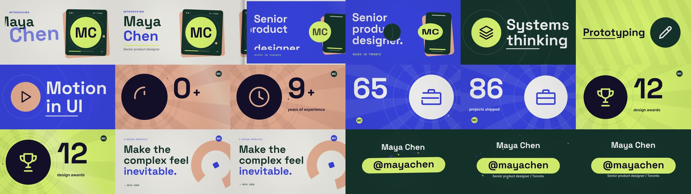

### Vertical social promo — Codex · gpt-6-astra · xhigh reasoning

> Make a 12-second vertical (9:16) social-media promo for a fictional coffee shop called "Brew & Co." announcing three autumn drinks with prices — Maple Latte €4.50, Spiced Cold Brew €4.00, Pumpkin Mocha €4.80 — and a call to action: "Open daily 7–19 · Main Street". Bold type, flat shapes and simple icon drawings (cups, leaves, beans), a beat-synced edit, punchy sound. It has to feel like real motion design, not a slideshow: objects and type travel and transform from one scene into the next, the camera moves, and every cut lands on the beat. Go all out.

| run | film | frame fill % ↑ | static % ↓ | longest static | LUFS / LRA | craft fail/warn | brief · reviews | wall · tokens |
|---|---|---:|---:|---:|---|---|---|---|
| Codex gpt-6-astra, no skill | 12.0 s · 1080×1920 | 35 | 0 | 0 s | -12.9 / 0.7 | – | no · 0 | 34 min · 1.4M |
| Codex gpt-6-astra + Cinewright | 12.0 s · 1080×1920 | 33 | 0 | 0 s | -14.1 / 0.6 | 0/0 | yes · 3 | 17 min · 7.8M |

*Reading (skill minus no-skill):* frame fill -2 pts · static time +0 pts · loudness range -0.1 LU · 5.6× the tokens · 0.5× the time. **The skill film is thinner on this metric.**

Codex gpt-6-astra, no skill — contact sheet

Codex gpt-6-astra + Cinewright — contact sheet

### YouTube channel intro — Codex · gpt-6-astra · xhigh reasoning

> Make an 8-second YouTube channel intro for a fictional tech-review channel called "Pixel Pulse": a logo mark that builds itself, the name, a one-line tagline you write, punchy transitions and sound design (a hit, whooshes, a short musical sting). Bold, bright, memorable. It has to feel like real motion design, not a slideshow: objects and type travel and transform from one scene into the next, the camera moves, and every cut lands on the beat. Go all out.

| run | film | frame fill % ↑ | static % ↓ | longest static | LUFS / LRA | craft fail/warn | brief · reviews | wall · tokens |
|---|---|---:|---:|---:|---|---|---|---|
| Codex gpt-6-astra, no skill | 8.0 s · 1920×1080 | 16 | 36 | 2.5 s | -13.9 / 4.1 | – | no · 0 | 22 min · 0k |
| Codex gpt-6-astra + Cinewright | 8.0 s · 1920×1080 | 31 | 14 | 0 s | -14.1 / 1.1 | 0/0 | yes · 3 | 30 min · 9.3M |

*Reading (skill minus no-skill):* frame fill +15 pts · static time -22 pts · loudness range -3 LU · 1.4× the time.

Codex gpt-6-astra, no skill — contact sheet

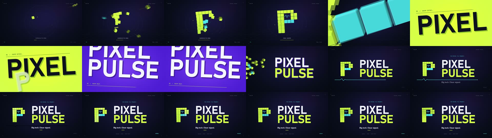

Codex gpt-6-astra + Cinewright — contact sheet

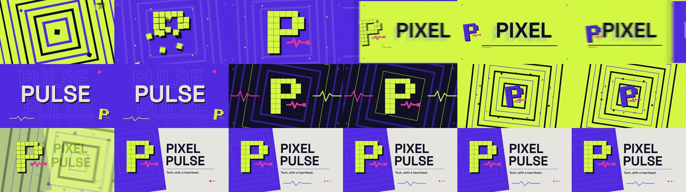

### Animated infographic — Codex · gpt-6-astra · xhigh reasoning

> Make a 20-second animated infographic explainer titled "Why sleep matters" with three facts — adults need 7–9 hours; one night of poor sleep can cut focus by about a third; a regular bedtime improves mood — each with an animated icon or chart (moon, brain, clock), counting numbers, a clear visual hierarchy, upbeat original music and sound design. It has to feel like real motion design, not a slideshow: objects and type travel and transform from one scene into the next, the camera moves, and every cut lands on the beat. Go all out.

| run | film | frame fill % ↑ | static % ↓ | longest static | LUFS / LRA | craft fail/warn | brief · reviews | wall · tokens |
|---|---|---:|---:|---:|---|---|---|---|
| Codex gpt-6-astra, no skill | 20.0 s · 1920×1080 | 12 | 57 | 2.5 s | -15 / 0.9 | – | no · 0 | 38 min · 1.6M |
| Codex gpt-6-astra + Cinewright | 20.0 s · 1920×1080 | 22 | 5 | 0 s | -14.1 / 1.2 | 0/0 | yes · 3 | 23 min · 7.2M |

*Reading (skill minus no-skill):* frame fill +10 pts · static time -52 pts · loudness range +0.3 LU · 4.4× the tokens · 0.6× the time.

Codex gpt-6-astra, no skill — contact sheet

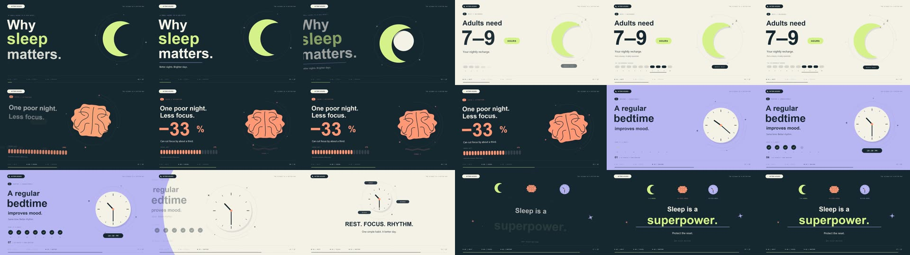

Codex gpt-6-astra + Cinewright — contact sheet

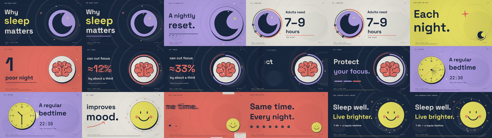

## Other kinds of film, with and without the skill (third pass)

Four jobs that are not intros: a vertical data story, a prestige title sequence, a meditative landscape with no text, an app explainer ([`benchmark/suite/variety.json`](../benchmark/suite/variety.json)). The prompts are the art-directed ones the earlier showcase runs used with the skill only; here both conditions get them, identically. The with-skill runs use the skill with the genre playbooks (`references/genres.md`). **Every complete pair we ran is listed.**

### Vertical data story — Codex · gpt-6-astra · xhigh reasoning

> Make a 15-second VERTICAL (9:16) social video that makes people feel one statistic: in the fictional city of Lumen, daily bike-share rides grew from 12,000 in 2021 to 87,000 in 2025. Hook in the first second (a number slams in), one hero visual (a city of dots growing into a river of light), big readable numbers that count up, a map or line-chart moment, a beat drop where 87,000 lands, safe areas for phone UI, punchy music with a drop, and an end card with a one-line takeaway. Go all out.

| run | film | frame fill % ↑ | static % ↓ | longest static | LUFS / LRA | craft fail/warn | brief · reviews | wall · tokens |
|---|---|---:|---:|---:|---|---|---|---|
| Codex gpt-6-astra, no skill | 15.0 s · 1080×1920 | 16 | 14 | 2 s | -13.6 / 2.3 | – | no · 0 | 22 min · 1.3M |
| Codex gpt-6-astra + Cinewright | 15.0 s · 1080×1920 | 26 | 0 | 0 s | -13.6 / 2 | 0/1 | yes · 3 | 46 min · 4.2M |

*Reading (skill minus no-skill):* frame fill +10 pts · static time -14 pts · loudness range -0.3 LU · 3.4× the tokens · 2.0× the time.

Codex gpt-6-astra, no skill — contact sheet

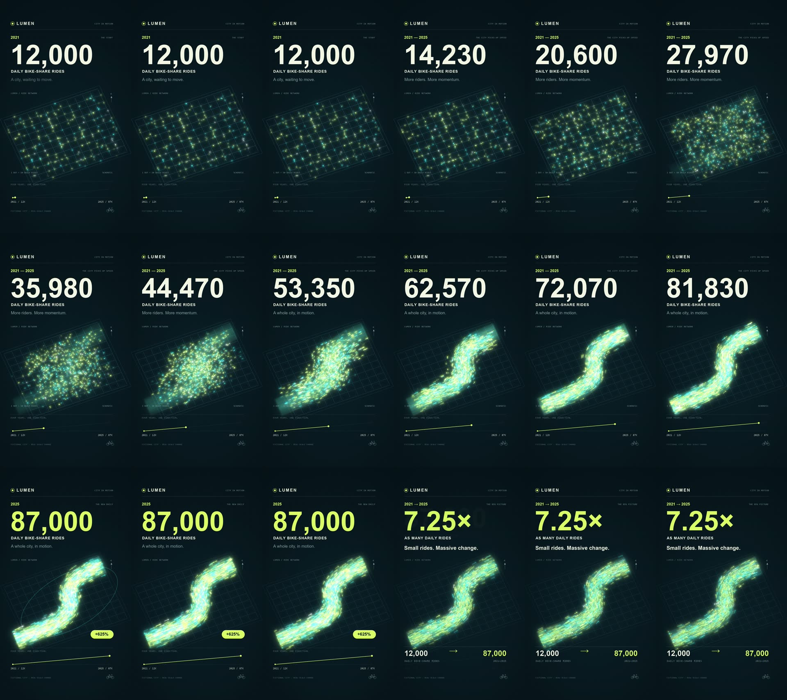

Codex gpt-6-astra + Cinewright — contact sheet

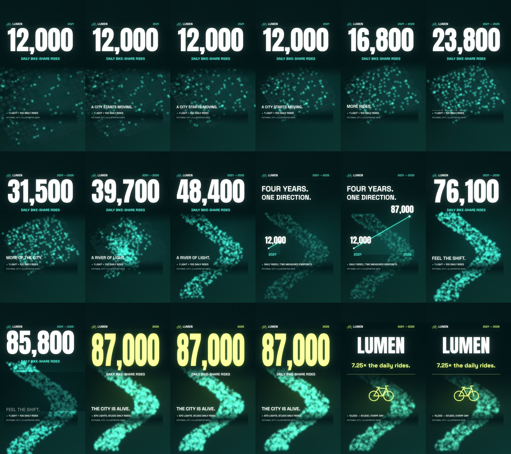

### Prestige title sequence — Codex · gpt-6-astra · xhigh reasoning

> Make a 25-second main-title sequence for a fictional prestige thriller series called "THE HOLLOW HOURS" (a night-shift detective in a city that never sleeps) — Saul Bass meets a modern streaming title. Build everything from abstract shapes, light, grain and type: cut-paper layers that peel apart, a flickering neon sign, rain streaking down glass with bokeh street lights, a clock whose hands unravel into thread, a silhouette made of falling particles. Credit-style typography with invented names ("Created by …", "Starring …"), a brooding original score with a heartbeat pulse and a low brass swell, and a final title lock-up that holds for two seconds. Go all out.

| run | film | frame fill % ↑ | static % ↓ | longest static | LUFS / LRA | craft fail/warn | brief · reviews | wall · tokens |
|---|---|---:|---:|---:|---|---|---|---|
| Codex gpt-6-astra, no skill | 25.0 s · 1920×1080 | 21 | 59 | 3.5 s | -15.3 / 4.6 | – | no · 0 | 24 min · 2.1M |
| Codex gpt-6-astra + Cinewright | 25.0 s · 1920×1080 | 38 | 9 | 1.5 s | -15 / 3.4 | 0/1 | yes · 3 | 60 min · 7.7M |

*Reading (skill minus no-skill):* frame fill +17 pts · static time -50 pts · loudness range -1.2 LU · 3.6× the tokens · 2.5× the time.

Codex gpt-6-astra, no skill — contact sheet

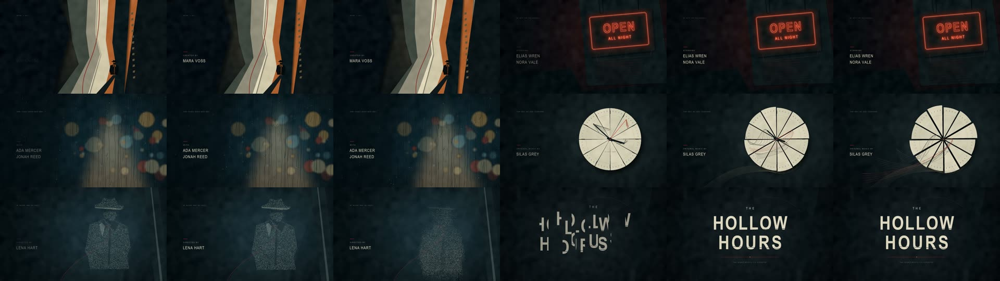

Codex gpt-6-astra + Cinewright — contact sheet

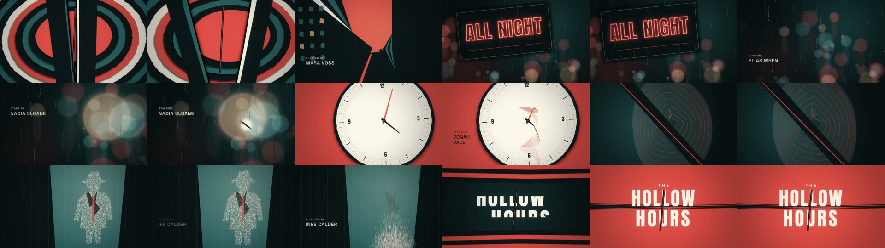

### Ambient landscape, no text — Codex · gpt-6-astra · xhigh reasoning

> Make a 15-second meditative cinematic landscape with no text at all: dusk over a procedural terrain with layered mountain ridges, drifting mist, an aurora ribbon in the sky, a slowly rising moon, fireflies, a slow crane move. A gentle original ambient score (pads, a soft pluck, sparse bells). Palette: deep indigo to rose gold. Make it so beautiful that someone would loop it. Go all out.

| run | film | frame fill % ↑ | static % ↓ | longest static | LUFS / LRA | craft fail/warn | brief · reviews | wall · tokens |
|---|---|---:|---:|---:|---|---|---|---|
| Codex gpt-6-astra, no skill | 15.0 s · 3840×2160 | 35 | 100 | 14 s | -17.9 / 2 | – | no · 0 | 37 min · 2.7M |
| Codex gpt-6-astra + Cinewright | 15.0 s · 1920×1080 | 46 | 100 | 14 s | -17.4 / 1.3 | 0/1 | yes · 3 | 31 min · 3.5M |

*Reading (skill minus no-skill):* frame fill +11 pts · static time +0 pts · loudness range -0.7 LU · 1.3× the tokens · 0.9× the time.

Codex gpt-6-astra, no skill — contact sheet

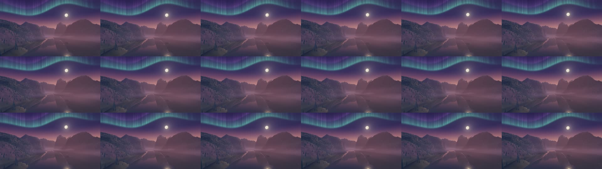

Codex gpt-6-astra + Cinewright — contact sheet

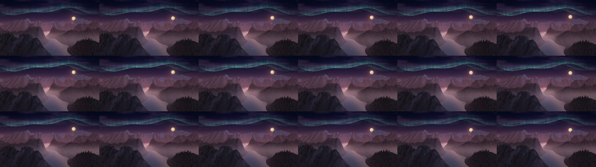

### App explainer — Codex · gpt-6-astra · xhigh reasoning

> Make a 20-second explainer video for "Pocketwise", a fictional app that turns shared household expenses into a simple monthly summary. Show the problem, the app UI (invent the screens), one satisfying data moment (numbers/chart), and end with the name and a one-line tagline. Original music and UI sound design. Go all out.

| run | film | frame fill % ↑ | static % ↓ | longest static | LUFS / LRA | craft fail/warn | brief · reviews | wall · tokens |
|---|---|---:|---:|---:|---|---|---|---|
| Codex gpt-6-astra, no skill | 20.0 s · 1920×1080 | 15 | 65 | 5 s | -14.3 / 1.2 | – | no · 0 | 25 min · 2.4M |
| Codex gpt-6-astra + Cinewright | 20.0 s · 1920×1080 | 48 | 16 | 0 s | -14 / 4.1 | 0/1 | yes · 3 | 58 min · 9.2M |

*Reading (skill minus no-skill):* frame fill +33 pts · static time -49 pts · loudness range +2.9 LU · 3.8× the tokens · 2.3× the time.

Codex gpt-6-astra, no skill — contact sheet

Codex gpt-6-astra + Cinewright — contact sheet

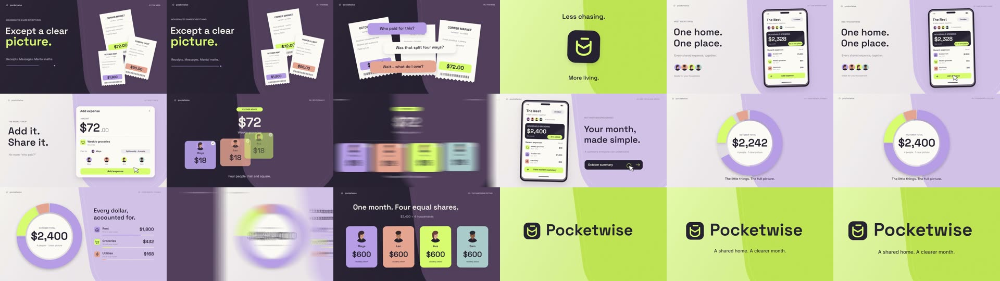

## Everyday motion graphics, plain prompts (first pass)

The jobs people ask for most — introduce a person, a channel intro, a vertical social promo, an animated infographic ([`benchmark/suite/simple.json`](../benchmark/suite/simple.json)). Plain-language prompts, no 3D spectacle, skill 2.2.0. The with-skill films were fuller and never static, but they were still decks of slides — which is what the second pass above set out to fix. **Every complete pair we ran is listed.**

### Introduce a person — Codex · gpt-6-astra · xhigh reasoning

> Make a 15-second motion graphics video that introduces a person: Maya Chen, a senior product designer from Toronto (invent the details). Show her name and role, three skills, three numbers (years of experience, projects shipped, awards) and a short quote, and end on her handle @mayachen. Clean, modern, energetic — the kind of intro a personal brand would open a talk or a portfolio with. Original music and sound design. Go all out.

| run | film | frame fill % ↑ | static % ↓ | longest static | LUFS / LRA | craft fail/warn | brief · reviews | wall · tokens |
|---|---|---:|---:|---:|---|---|---|---|
| Codex gpt-6-astra, no skill | 15.0 s · 1920×1080 | 14 | 57 | 2 s | -14.4 / 1.2 | – | no · 0 | 23 min · 2.7M |
| Codex gpt-6-astra + Cinewright | 15.0 s · 1920×1080 | 50 | 0 | 0 s | -14.1 / 1.5 | 0/1 | yes · 3 | 30 min · 7.4M |

*Reading (skill minus no-skill):* frame fill +36 pts · static time -57 pts · loudness range +0.3 LU · 2.8× the tokens · 1.3× the time.

Codex gpt-6-astra, no skill — contact sheet

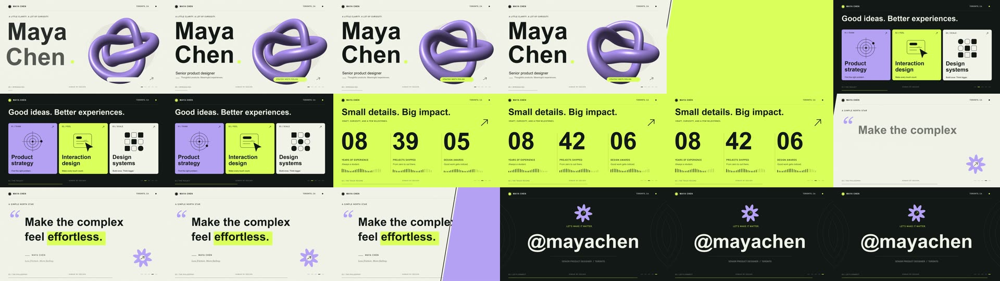

Codex gpt-6-astra + Cinewright — contact sheet

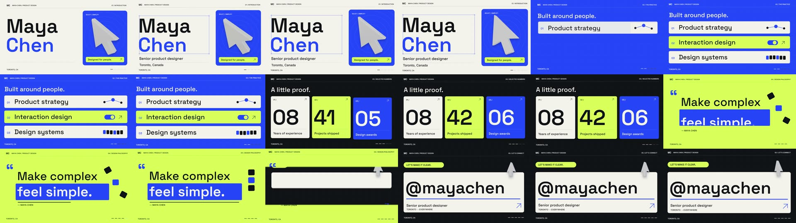

### Vertical social promo — Codex · gpt-6-astra · xhigh reasoning

> Make a 12-second vertical (9:16) social-media promo for a fictional coffee shop called "Brew & Co." announcing three autumn drinks with prices — Maple Latte €4.50, Spiced Cold Brew €4.00, Pumpkin Mocha €4.80 — and a call to action: "Open daily 7–19 · Main Street". Bold type, flat shapes and simple icon drawings (cups, leaves, beans), a beat-synced edit, punchy sound. Go all out.

| run | film | frame fill % ↑ | static % ↓ | longest static | LUFS / LRA | craft fail/warn | brief · reviews | wall · tokens |
|---|---|---:|---:|---:|---|---|---|---|
| Codex gpt-6-astra, no skill | 12.0 s · 1080×1920 | 36 | 41 | 1.5 s | -13.1 / 0.4 | – | no · 0 | 25 min · 2.5M |
| Codex gpt-6-astra + Cinewright | 12.0 s · 1080×1920 | 37 | 0 | 0 s | -14.1 / 0.8 | 0/0 | yes · 3 | 42 min · 9.1M |

*Reading (skill minus no-skill):* frame fill +1 pts · static time -41 pts · loudness range +0.4 LU · 3.6× the tokens · 1.7× the time.

Codex gpt-6-astra, no skill — contact sheet

Codex gpt-6-astra + Cinewright — contact sheet

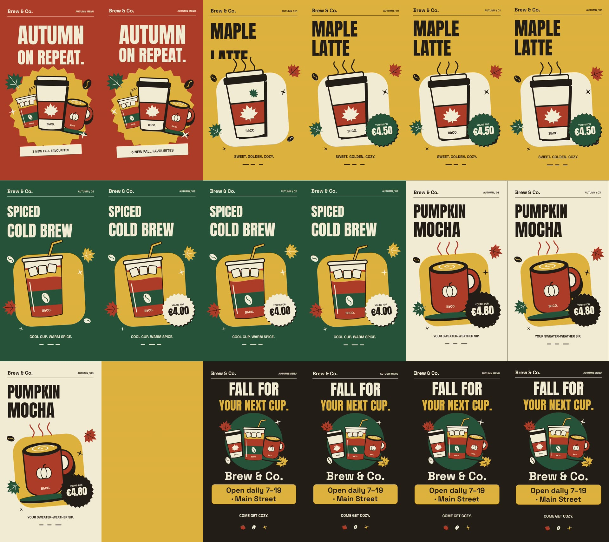

### YouTube channel intro — Codex · gpt-6-astra · xhigh reasoning

> Make an 8-second YouTube channel intro for a fictional tech-review channel called "Pixel Pulse": a logo mark that builds itself, the name, a one-line tagline you write, punchy transitions and sound design (a hit, whooshes, a short musical sting). Bold, bright, memorable. Go all out.

| run | film | frame fill % ↑ | static % ↓ | longest static | LUFS / LRA | craft fail/warn | brief · reviews | wall · tokens |
|---|---|---:|---:|---:|---|---|---|---|
| Codex gpt-6-astra, no skill | 8.0 s · 1920×1080 | 9 | 57 | 3 s | -14.1 / 7 | – | no · 0 | 16 min · 1.1M |
| Codex gpt-6-astra + Cinewright | 8.0 s · 1920×1080 | 31 | 14 | 0 s | -14.2 / 0.7 | 0/1 | yes · 3 | 27 min · 5.4M |

*Reading (skill minus no-skill):* frame fill +22 pts · static time -43 pts · loudness range -6.3 LU · 5.1× the tokens · 1.7× the time.

Codex gpt-6-astra, no skill — contact sheet

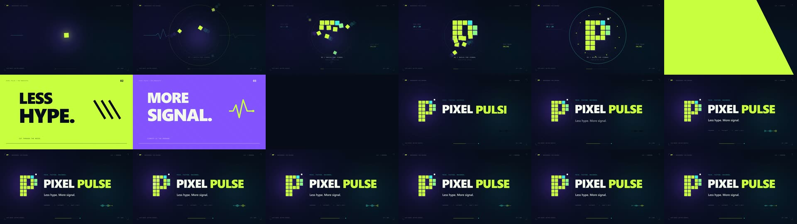

Codex gpt-6-astra + Cinewright — contact sheet

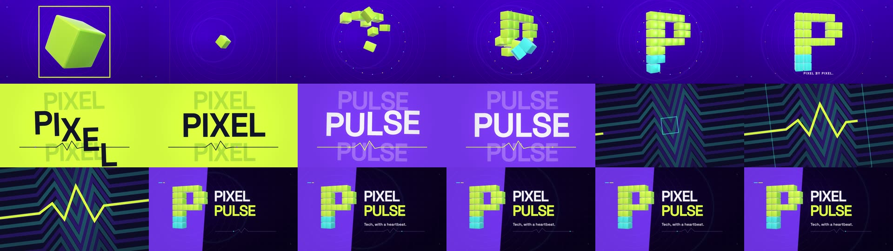

### Animated infographic — Codex · gpt-6-astra · xhigh reasoning

> Make a 20-second animated infographic explainer titled "Why sleep matters" with three facts — adults need 7–9 hours; one night of poor sleep can cut focus by about a third; a regular bedtime improves mood — each with an animated icon or chart (moon, brain, clock), counting numbers, a clear visual hierarchy, upbeat original music and sound design. Go all out.

| run | film | frame fill % ↑ | static % ↓ | longest static | LUFS / LRA | craft fail/warn | brief · reviews | wall · tokens |
|---|---|---:|---:|---:|---|---|---|---|
| Codex gpt-6-astra, no skill | 20.0 s · 1920×1080 | 12 | 73 | 3.5 s | -14.1 / 0.8 | – | no · 0 | 21 min · 2.5M |
| Codex gpt-6-astra + Cinewright | 20.0 s · 1920×1080 | 26 | 8 | 0 s | -14.2 / 2.2 | 0/0 | yes · 3 | 24 min · 7.0M |

*Reading (skill minus no-skill):* frame fill +14 pts · static time -65 pts · loudness range +1.4 LU · 2.8× the tokens · 1.2× the time.

Codex gpt-6-astra, no skill — contact sheet

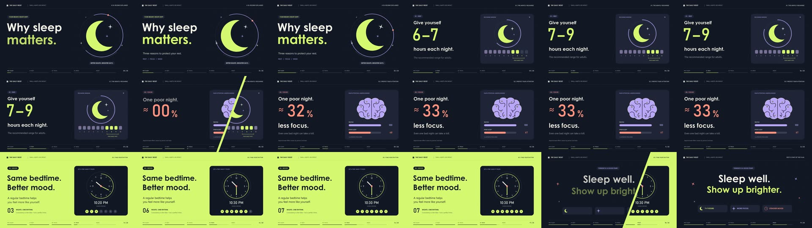

Codex gpt-6-astra + Cinewright — contact sheet

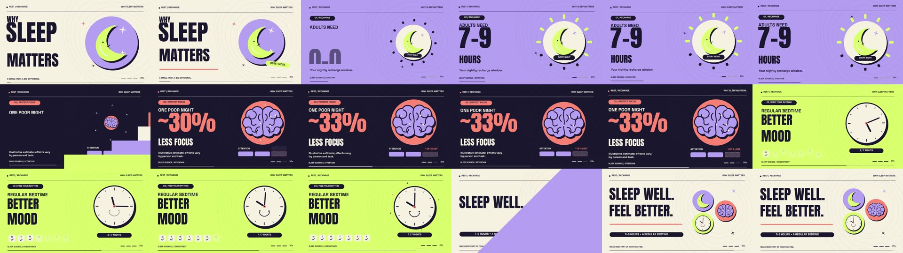

## Strong prompts, with and without the skill

Art-directed prompts that ask for spectacle on purpose ([`benchmark/suite/showcase.json`](../benchmark/suite/showcase.json)). **Every complete pair we ran is listed — nothing is selected.** Where the skill lost, the table says so (and the development log below says what we changed because of it).

### Product launch film — ARC — Codex · gpt-6-astra · xhigh reasoning

> Make a 30-second launch film for ARC, a fictional titanium smart ring — a seven-figure brand film made entirely from code. Look: a dark studio that is NOT monochrome — pools of coloured light (a cool teal key, a warm amber rim, a violet accent) sweep across brushed titanium with real reflections, and the camera never stops moving. Structure: (0–6 s) an extreme macro of the metal grain catching a travelling highlight, …

| run | film | frame fill % ↑ | static % ↓ | longest static | LUFS / LRA | craft fail/warn | brief · reviews | wall · tokens |
|---|---|---:|---:|---:|---|---|---|---|
| Codex gpt-6-astra, no skill | 30.0 s · 1920×1080 | 11 | 32 | 3 s | -16 / 6.2 | – | no · 0 | 38 min · 2.6M |
| Codex gpt-6-astra + Cinewright | 30.0 s · 1920×1080 | 13 | 64 | 3.5 s | -14 / 5.4 | 0/0 | yes · 3 | 40 min · 5.4M |

*Reading (skill minus no-skill):* frame fill +2 pts · static time +32 pts · loudness range -0.8 LU · 2.1× the tokens · 1.1× the time. **The skill film has more static time.**

Codex gpt-6-astra, no skill — contact sheet

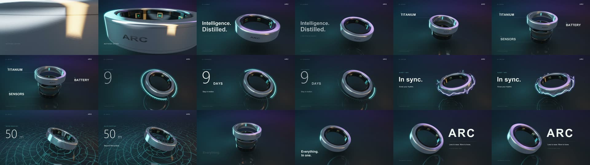

Codex gpt-6-astra + Cinewright — contact sheet

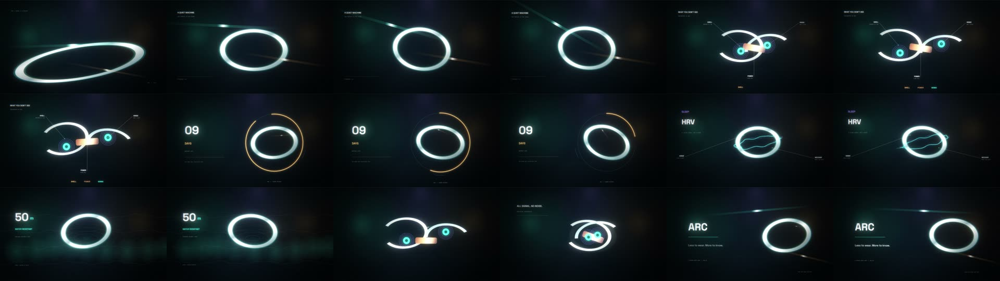

### Sci-fi teaser — LAST SIGNAL — Codex · gpt-6-astra · xhigh reasoning

> Make a 25-second teaser trailer for "LAST SIGNAL" (a lone deep-space station keeps receiving a transmission from its own future). Cinematic dread: slow push-ins, flickering practical lights, cold blue instrument glow against one warm emergency red, heavy film grain, anamorphic streaks, a flythrough of a dim corridor, a waveform that resolves into a faceless silhouette made of particles, countdown numerals, decoded te …

| run | film | frame fill % ↑ | static % ↓ | longest static | LUFS / LRA | craft fail/warn | brief · reviews | wall · tokens |
|---|---|---:|---:|---:|---|---|---|---|
| Codex gpt-6-astra, no skill | 25.0 s · 1920×1080 | 14 | 46 | 3.5 s | -17.5 / 11.8 | – | no · 0 | 53 min · 1.7M |
| Codex gpt-6-astra + Cinewright | 25.0 s · 1920×1080 | 8 | 54 | 3.5 s | -16.4 / 9.2 | 0/0 | yes · 3 | 67 min · 9.5M |

*Reading (skill minus no-skill):* frame fill -6 pts · static time +8 pts · loudness range -2.6 LU · 5.6× the tokens · 1.3× the time. **The skill film is thinner on this metric.** **The skill film has more static time.**

Codex gpt-6-astra, no skill — contact sheet

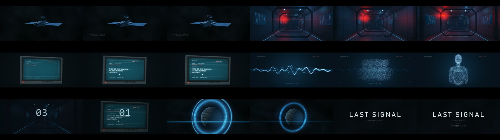

Codex gpt-6-astra + Cinewright — contact sheet

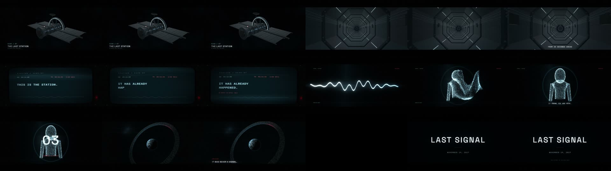

### Audio-reactive music visualizer — Codex · gpt-6-astra · xhigh reasoning

> First compose a 24-second original electronic track (synthesise it yourself): intro, build, drop, outro. Then make an audio-reactive music visualizer for it. The picture must be driven by the track's real analysis (envelopes of kick, bass, hats and lead): a GPU particle field that pulses with the kick, a bass-driven tunnel or terrain, a ring equaliser, light streaks on the hats, a palette that shifts at the drop. The …

| run | film | frame fill % ↑ | static % ↓ | longest static | LUFS / LRA | craft fail/warn | brief · reviews | wall · tokens |
|---|---|---:|---:|---:|---|---|---|---|
| Codex gpt-6-astra, no skill | 24.0 s · 960×540 | 37 | 0 | 0 s | -8.5 / 4.6 | – | no · 0 | 18 min · 1.8M |
| Codex gpt-6-astra + Cinewright | 24.0 s · 1920×1080 | 22 | 16 | 3.5 s | -14.3 / 4.6 | 0/0 | yes · 3 | 76 min · 0k |

*Reading (skill minus no-skill):* frame fill -15 pts · static time +16 pts · loudness range +0 LU · 4.2× the time. **The skill film is thinner on this metric.** **The skill film has more static time.**

Codex gpt-6-astra, no skill — contact sheet

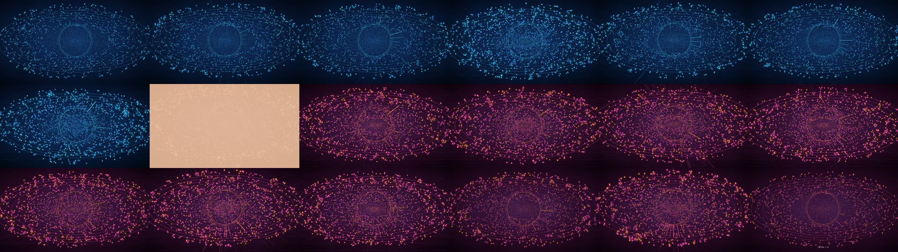

Codex gpt-6-astra + Cinewright — contact sheet

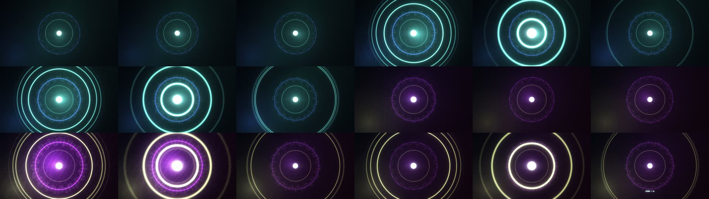

### Sci-fi interface boot sequence — Codex · gpt-6-astra · xhigh reasoning

> Make a 15-second cinematic sci-fi interface sequence — a fictional starship's HUD booting up: radial menus, hex grids, scanning lines, a rotating 3D wireframe planet with orbit markers, data read-outs with counting numbers, a waveform scope, amber warnings, and a final "ALL SYSTEMS NOMINAL" glow. Layered parallax, constant micro-motion, glitches on the cuts, a scan-line / CRT grade. Sound: UI beeps, servo whirs, a ri …

| run | film | frame fill % ↑ | static % ↓ | longest static | LUFS / LRA | craft fail/warn | brief · reviews | wall · tokens |
|---|---|---:|---:|---:|---|---|---|---|
| Codex gpt-6-astra, no skill | 15.0 s · 1280×720 | 9 | 82 | 3 s | -18.6 / 9.5 | – | no · 0 | 20 min · 1.7M |
| Codex gpt-6-astra + Cinewright | 15.0 s · 1920×1080 | 26 | 25 | 2 s | -14.1 / 6.4 | 0/0 | yes · 3 | 27 min · 3.2M |

*Reading (skill minus no-skill):* frame fill +17 pts · static time -57 pts · loudness range -3.1 LU · 1.9× the tokens · 1.3× the time.

Codex gpt-6-astra, no skill — contact sheet

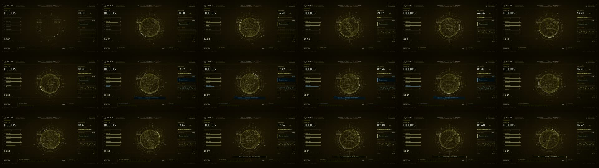

Codex gpt-6-astra + Cinewright — contact sheet

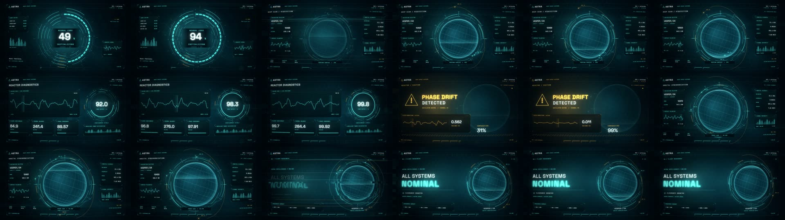

## Films made with the skill only

These prompts were run once with the skill (they are the films on the website's *Made with it* wall); there is no no-skill twin to compare. The prompts are in [`benchmark/suite/showcase.json`](../benchmark/suite/showcase.json).

| run | film | frame fill % ↑ | static % ↓ | longest static | LUFS / LRA | craft fail/warn | brief · reviews | wall · tokens |
|---|---|---:|---:|---:|---|---|---|---|
| Meditative landscape, no text — Codex gpt-6-astra + Cinewright | 15.0 s · 1920×1080 | 51 | 93 | 13 s | -13.8 / 1.2 | 0/3 | yes · 0 | 28 min · 5.6M |
| Vertical data story — Codex gpt-6-astra + Cinewright | 15.0 s · 1080×1920 | 35 | 0 | 0 s | -14.3 / 2.7 | 0/0 | yes · 3 | 48 min · 5.8M |
| Event promo — Claude Code (Sonnet 5.5) + Cinewright | 15.0 s · 1920×1080 | 58 | 4 | 0 s | -14 / 3.6 | 0/0 | yes · 3 | – · – |
| App explainer — Claude Code (Sonnet 5.5) + Cinewright | 20.0 s · 1920×1080 | 26 | 8 | 0 s | -13.9 / 4.5 | 0/0 | yes · 3 | – · – |
| Product launch film — Codex gpt-6-astra + Cinewright | 30.0 s · 1920×1080 | 15 | 52 | 3.5 s | -14.2 / 2.6 | 0/0 | yes · 3 | 63 min · 8.4M |
| Kinetic typography manifesto — Codex gpt-6-astra + Cinewright | 20.0 s · 1920×1080 | 43 | 0 | 0 s | -14.4 / 1.3 | 0/1 | yes · 3 | 39 min · 4.7M |
| Kinetic typography manifesto — Claude Code (Sonnet 5.5) + Cinewright | 20.0 s · 1920×1080 | 35 | 0 | 0 s | -14 / 4.8 | 0/0 | yes · 3 | – · – |
| Prestige-drama title sequence — Codex gpt-6-astra + Cinewright | 25.0 s · 1920×1080 | 36 | 7 | 1.5 s | -14 / 6.7 | 0/0 | yes · 3 | 56 min · 8.8M |

## Development log — what we changed because of what we measured

**First pass (archived in [`benchmark/archive/`](../benchmark/archive/); Codex 0.148, reasoning *high*, one run per cell).** On the showreel prompt the *no-skill* Codex film (frame fill 32 %, 0 % static) beat the first Cinewright 2.1 build (frame fill 6 %, 21 % static, three perfunctory review files, no picture ever looked at). On a second task, a 6-second logo sting, the skill run spawned a sound sub-agent and then sat until the 50-minute timeout without a film, while the same task without the skill finished in 12 minutes. We treated both as bugs **in the skill**, not in the benchmark:

- `qc.mjs look` (frame fill) became a gate and the protocol got a measured **boldness floor** (median fill ≥ 25 %): "go all out" means spectacle, not thin lines on black;
- `qc.mjs craft` now rejects rubber-stamp reviews — a real review names the scene, the cause and the exact change, and it is written after looking at frames;
- SKILL.md says *fork a template, don't start from a blank page*, and never to spawn unattended sub-agents;
- the runner got hard timeouts that cannot hang on orphaned child processes, and (later) automatic retries for dropped connections.

The headline results above are the re-run with those fixes, at **xhigh** reasoning on two models. They are a first data point, not a verdict: one run per cell, and the no-skill baseline at xhigh is a strong film too — Codex without the skill wrote a small GPU renderer in Python and delivered a bold, well-designed reel. What the skill adds in these runs is **range** (more disciplines in 15 s: GPU particles, chrome 3D, liquid shaders, UI motion), **a mixed soundtrack with dynamics** (the baseline's loudness range is almost flat), **fewer static stretches**, and a written, gated process — at several times the token cost.

**Second pass (four art-directed prompts, Codex · gpt-6-astra · xhigh).** A sci-fi interface boot, a product-launch film (ARC), a sci-fi teaser (LAST SIGNAL) and an audio-reactive visualizer. The skill won one clearly (the interface: frame fill 9 → 26 %, static time 82 → 25 %), split on LAST SIGNAL, and **lost two**: for ARC the skill run drew the titanium ring as a thin 2D circle (13 % fill, 64 % of the film near-static) and shipped it after accepting its own warnings; the visualizer run was still polishing when the 75-minute timer ended. Both are bugs of the skill, so we changed the skill, not the benchmark:

- the pacing and frame-fill checks became hard **FAIL**s (median fill < 15 %, more than half the film near-static) unless the brief declares a deliberate `Restraint: …`, and `craft` warns when a film uses nothing but flat 2D canvas;
- a hero *object* is a lit 3D mesh, never an outline — the atlas got the recipe `product-ring-macro` (environment-lit ring, floor reflection, macro dolly, exploded view);
- the protocol has a **time-box**: ship a first complete deliverable right after the skeleton and overwrite it as polish rounds land, so a timer can no longer leave a project without a film.

**Third pass (everyday prompts, Codex · gpt-6-astra · xhigh).** After the second pass the project owner redirected the work: most real requests are not 3D showpieces but a person intro, a channel intro, a promo, an infographic — *simple* motion graphics that should simply look good. So the skill got a motion-graphics kit (the film is a JSON spec; picture and sound are both generated from it) and the benchmark got a suite of five plain-language prompts ([`benchmark/suite/simple.json`](../benchmark/suite/simple.json)). Baselines first, then the skill runs from a snapshot of the skill taken before the last polish of the kit. What came out, honestly:

- **Introduce a person:** frame fill 14 → 50 %, near-static time 57 → 0 %, at 2.8× the tokens. The with-skill film is a different *design* (bold colour blocks, a 3D cursor, interface rows with toggles), not the same film with more motion.
- **Vertical social promo:** a draw on design (frame fill 36 vs 37 %) — unaided, Codex already lays out a very good poster-style promo; the skill removed the static stretches (41 → 0 %) and added a brief and three review rounds, at 3.6× the tokens and 1.7× the time.
- **Channel intro:** frame fill 9 → 31 %, near-static time 57 → 14 %, at 5.1× the tokens and 1.7× the time. The mark is now built from lit 3D cubes instead of flat squares. One honest loss: the no-skill sting has the *wider* loudness range (7 vs 0.7 LU — a quiet start and one big hit); the with-skill mix is flatter.
- **Animated infographic:** frame fill 12 → 26 %, near-static time 73 → 8 %, loudness range 0.8 → 2.2 LU, at 2.8× the tokens and 1.2× the time. Again a different design: a bold poster style with drawn moon, brain and clock characters instead of dark cards.

Operational notes, because they affect how to read the table: the skill runs were scheduled in two parallel queues and the first attempts of two jobs ended after about 13 minutes when the gateway between Codex and the model reported a usage limit — they were re-run from scratch (the person-intro film is its third attempt; `attempts: 3` in its summary). Later a network error silently hung two more jobs for 25 minutes, which is why the runner now has a stall watchdog (`--stall-min`); then the model gateway on the test machine stopped answering for about 50 minutes, and the channel-intro and infographic runs were started again from scratch once it was back. The skill snapshot used for all four runs was taken before the last polish of the kit (the shipped 2.2.0 kit has since gained ambient motion, so that every preset passes the pacing gate as shipped).

**Fourth pass (the same everyday jobs, prompts that ask for real motion design; Codex · gpt-6-astra · xhigh).** The project owner's verdict on the third pass was: *better, but still a slideshow — it does not look like real motion graphics.* We took that seriously and looked at the frames instead of the metrics (every third-pass film passed the pacing and fill gates). What we found:

1. **The structure was a deck of slides.** Even after the continuity work (whips, an iris, one carried object), every preset was five scenes of three seconds — a heading above three cards, then the next heading — and the with-skill films Codex made from them had the same shape. Transitions do not change that; layout and pacing do.
2. **"Go all out" sent the agent past the kit.** A first re-run on the new prompts (the intermediate skill; archived in [`benchmark/archive/motion-v2/`](../benchmark/archive/motion-v2/)) did not use the motion kit at all: Codex scaffolded the blank `basic` template and hand-wrote five three-second chapters in 70 and 55 minutes (frame fill 14 % and 21 %; the person intro was a fine editorial design with a 3D knot — and five slides). The routing was our fault: SKILL.md called the kit "simple 2D", the protocol's scaffold step listed only the cinematic templates, and `inspire.mjs` told every brief — including a person intro — to fork `--template cinema` with a five-row timeline.
3. **The prompt mattered, for both conditions.** The plain third-pass prompts invited slides from both sides. The new prompts add one sentence — *"it has to feel like real motion design, not a slideshow: objects and type travel and transform from one scene into the next, the camera moves, and every cut lands on the beat"* — to the *same* four jobs, identically for the baseline and the skill ([`benchmark/suite/motion.json`](../benchmark/suite/motion.json)). It lifted the no-skill films too (the channel-intro baseline is now a good idea: lit 3D pixel cubes that build a P, the camera diving into the type).

What we changed in the skill: every preset is re-cut into 7–10 *one-idea shots* of 1–2 seconds (a new `hit` scene; `fact` gained a mirrored layout and fitted text; one-idea scenes compress their entrances to the shot length), a carried object that recolours itself against any flood, a camera that breathes through every shot, a score with an arc (pads first, the groove drops in at ~4 s), a *route first* table at the top of SKILL.md, `inspire.mjs` that routes everyday briefs to the kit and cuts its skeleton into shots, `anti-slideshow.md` §0 *Shots, not slides*, and `qc craft` checks (shots per second, rows of cards, travelling transitions, a carried object) — see the 2.3.0 changelog. Then the baselines and the with-skill runs were done again from a snapshot of the skill taken before the runs. What came out, honestly:

- **Introduce a person:** frame fill 12 → 25 %, near-static 54 → 0 %, loudness range 0.5 → 1.8 LU, at 3.4× the tokens and 1.1× the time. The baseline is a handsome editorial piece with a purple 3D ring — and five chapters; the with-skill film is ten one-idea shots joined by whips, an iris and a zoom, with one badge that becomes the tablet, an icon per skill and finally the handle pill.
- **Channel intro:** frame fill 16 → 31 %, near-static 36 → 14 %, at 1.4× the time. **A loss to report:** the no-skill sting has the wider loudness range (4.1 vs 1.1 LU — a quiet start and one big hit). Here the unaided idea is as good as the skill's; what the skill adds is density (a tunnel of squares, a P that travels through seven shots, whips with motion blur) and the process.
- **Vertical social promo:** a draw. Unaided, Codex lays out a very good poster-style promo with hand-drawn cups (frame fill 35 vs 33 %, neither film is ever static). The with-skill film is cut into eight shots with a carried bean badge, took half the wall-clock time (17 vs 34 min) and 5.6× the tokens; the no-skill mix is louder (−12.9 vs −14.1 LUFS), the skill mix is on target.
- **Animated infographic:** frame fill 12 → 22 %, near-static 57 → 5 %, loudness range 0.9 → 1.2 LU, at 4.4× the tokens and 0.6× the time (23 vs 38 minutes). The baseline is a neat explainer — a moon, a brain, a clock, one fact per slide; the with-skill film is eleven shots in which one icon turns from a moon into a clock, a brain and a smiley, joined by zooms, irises, a whip and blinds.
How to read these: one run per cell; the baselines of the person intro and the infographic each needed a second attempt after a dropped connection (recorded as `transportFailures` in their summaries); the metrics cannot see "looks like motion graphics" — the films can (watch them on the site). In all four with-skill runs Codex used the motion kit as a *film grammar* and added custom scenes where the subject needed a drawing of its own (a phone with a badge, an illustrated cup, a pixel P in a tunnel of squares), so the four films do not look alike. The tested skill is the snapshot `skill-v3`; after it was taken the shipped skill gained two small changes — an aspect-ratio note in `motion-graphics.md`, and a fix to the `hit` scene (a statement of more than four words now wraps into up to four lines instead of printing as one tiny line, which we found while testing odd options); the presets and everything the runs touched are unchanged. Operational notes: one detached queue died silently the first time (its partial run folders were removed and the jobs re-run from scratch); the runner now also treats a half-written `final.mp4` plus a transport error as a dropped connection instead of a result.

**Fifth pass (other kinds of film; Codex · gpt-6-astra · xhigh).** Intros and promos are not the only thing people ask for, so the next pass tested four jobs that fail in their own ways: a vertical data story (LUMEN), a prestige title sequence (THE HOLLOW HOURS), a meditative landscape with no text, and an app explainer (Pocketwise) — the art-directed prompts the earlier showcase runs used with the skill only, now given identically to both conditions ([`benchmark/suite/variety.json`](../benchmark/suite/variety.json)). Before the runs we looked at what the older skill had made of these genres (a flat, clip-art landscape; a title sequence of static credit cards) and gave the skill **genre playbooks** (`references/genres.md`: structure, look, failure modes, sound and starting recipes per genre), a tested `light-dusk-landscape` recipe, a `qc loop` seam check, and an `inspire.mjs` that names the genre and suggests the right template. The with-skill runs used a snapshot of exactly the shipped skill. What came out, honestly:

- **Title sequence:** the clearest gain. Unaided, Codex has the right ideas (neon, rain, a clock, a silhouette) but plays them as quiet vignettes with credits on cards — 59 % of the frames static. With the playbook every credit lands on a moving graphic shot and one red clock hand runs through the whole film into the title: 9 % static, frame fill 21 → 38 %, at 3.6× the tokens and 2.5× the time.
- **App explainer:** a clear gain. The baseline is a tidy product page in four sections (headline left, card right; 65 % static). The skill film tells it in shots — receipt chaos, one expense split four ways, a whip to the monthly donut, four equal shares: 16 % static, frame fill 15 → 48 %, at 3.8× the tokens and 2.3× the time.
- **Vertical data story:** close. Both agents turn a grid of dots into a river of light; the baseline has finer HUD detail, the skill film reads better on a phone (numbers twice the size, a dedicated chart shot, a yellow 87,000 on the drop) and is never static (0 vs 14 %), at 3.4× the tokens and 2× the time.
- **Ambient landscape:** a draw. Both ray-march a real 3D valley and both loops are seamless (`qc loop`). The skill film has more depth (six ridges of mist, a river, fireflies; frame fill 35 → 46 %), the baseline has the bolder aurora and a 4K render. Cost was close: 1.3× the tokens, slightly less time.

The best film of each kind went to the website: the new with-skill title sequence and landscape replaced the older showcase films of those genres; for the data story and the app explainer the older showcase films are still at least as good and stayed. How to read these: one run per cell, every run on its first attempt. Operational note: all three detached queues were stopped together after the first four jobs by an outside console signal; the four interrupted jobs were moved aside and re-run from scratch, one queue each.

### Archived runs (earlier skill builds and first attempts)

Kept so nothing is hidden; they are *not* part of the tables above. Folder: [`benchmark/archive/`](../benchmark/archive/).

| run | film | frame fill % ↑ | static % ↓ | longest static | LUFS / LRA | craft fail/warn | brief · reviews | wall · tokens |
|---|---|---:|---:|---:|---|---|---|---|
| Logo sting — Codex, no skill [skill none, 20261006-1742-first-pass] | 6.0 s · 1920×1080 | 4 | 45 | 2.5 s | -17.1 / 6.7 | – | no · 0 | 12 min · 972k |
| Logo sting — Codex + Cinewright (first 2.1 build) [skill 2.1.0, 20261006-1742-first-pass] | ✘ no video was produced | – | – | – | – | 0/1 | yes · 0 | 50 min · 0k |
| Motion-designer showreel — Codex, no skill [skill none, 20261006-1742-first-pass] | 15.0 s · 1920×1080 | 32 | 0 | 0 s | -14.5 / 1 | – | no · 0 | 12 min · 1.2M |
| Motion-designer showreel — Codex + Cinewright (first 2.1 build) [skill 2.1.0, 20261006-1742-first-pass] | 15.0 s · 1920×1080 | 6 | 21 | 2 s | -14 / 0.9 | 0/3 | yes · 3 | 15 min · 1.8M |
| Motion-designer showreel — Codex + skill v1.1 [skill 1.1, history-earlier-versions] | 15.0 s · 1920×1080 | 27 | 11 | 1.5 s | -14.1 / 3.5 | – | – | – · – |
| YouTube channel intro — Codex gpt-6-astra + Cinewright [skill 2.3.0-draft, motion-v2] | 8.0 s · 1920×1080 | 21 | 14 | 0 s | -14.1 / 1 | 0/1 | yes · 0 | 55 min · 0k |
| Introduce a person — Codex gpt-6-astra + Cinewright [skill 2.3.0-draft, motion-v2] | 15.0 s · 1920×1080 | 14 | 21 | 0 s | -14.3 / 1.4 | 0/1 | yes · 3 | 70 min · 3.8M |

## Caveats (read before quoting any number)

- Agents are stochastic: one run per cell is an anecdote. Use `--reps 3` or more before drawing conclusions, and report the spread.
- The metrics measure *motion and sound hygiene*, not taste. A film can score perfectly and still be ugly — that is what your eyes are for.
- Rows made by different agents or models are **not** comparable with each other; compare each agent with itself.
- "Contaminated" means a no-skill run nevertheless read the skill; such runs should be discarded.
- The runner disables any globally installed copy of the skill for baseline runs (`skills.config` in Codex) and installs the version under test into the run's own project folder, so a stale install on your machine cannot leak into the comparison.
- A dropped connection is not a result: the runner retries transport failures (up to twice) in a fresh folder and records them.
