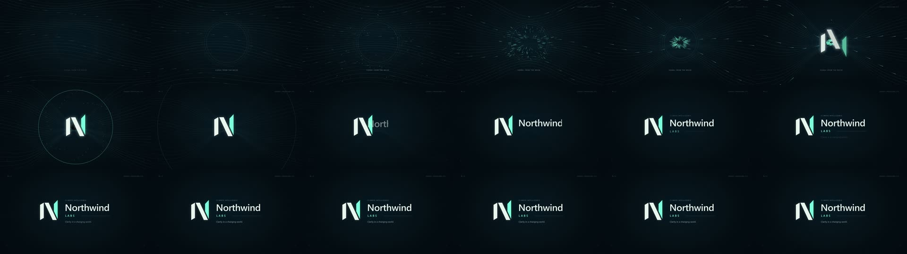
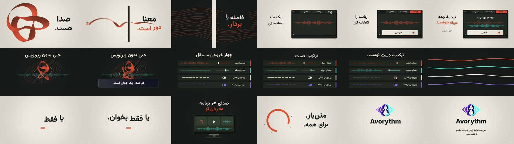
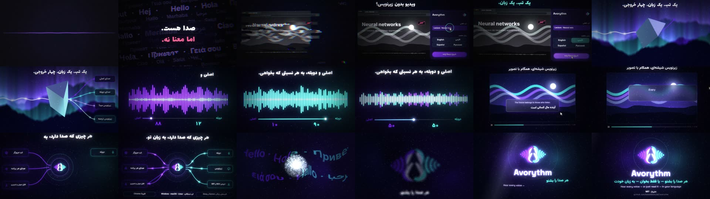
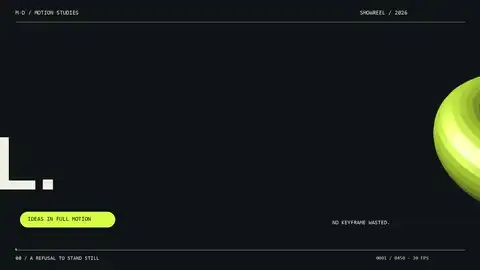
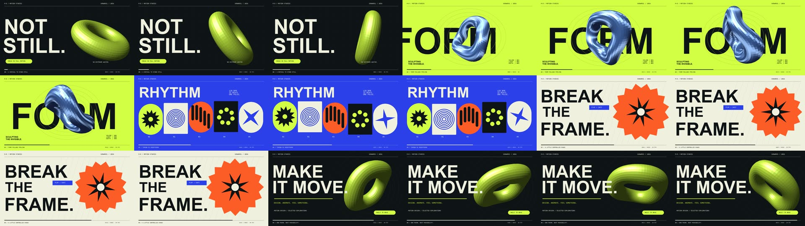
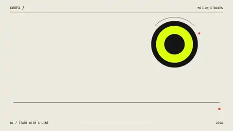
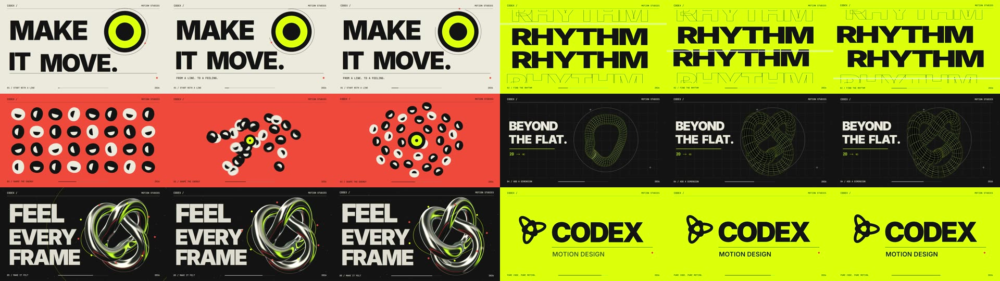
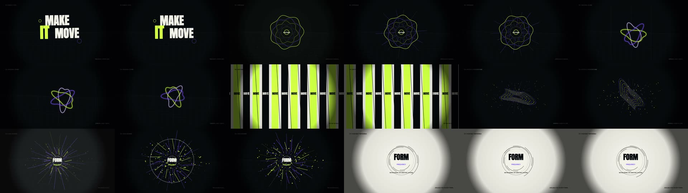

# Benchmark: the same prompt, with and without the skill

<!-- GENERATED by benchmark/report.mjs from benchmark/results/**/summary.json — do not edit by hand. -->

Claims about creative tools are cheap, so this repository ships the means to **measure** them: a runner that gives a coding agent (Codex by default) the *same prompt* in a fresh folder with and without the skill, and a set of objective metrics computed from the finished MP4. See [`benchmark/README.md`](../benchmark/README.md) to run it yourself — `node benchmark/run.mjs --suite quick`.

**How to read the numbers.** They detect the classic failure of agent-made video — *a slideshow with no sound design* — they do not judge beauty. For beauty there is a blind A/B rating tool (`node benchmark/rate.mjs`); post your ratings in an issue.

| metric | meaning | better |
|---|---|---|
| quiet % | share of the film where almost nothing changes frame-to-frame (`qc.mjs energy`) | lower |
| frame fill % | median share of each frame that is not background (`qc.mjs look`): thin lines on empty black score under 10, full-bleed posters 30–55 | higher |
| longest static | the longest stretch with almost no change, seconds | lower |
| scene changes | substantial picture changes (ffmpeg scene score > 0.25) | context |
| LUFS / LRA | loudness (social target ≈ −14) and loudness range (dynamics; < 2 LU is flat) | −14 / higher |
| craft | `qc.mjs craft` failures/warnings on the project (only for projects made with the skill's structure) | 0 / 0 |
| brief · reviews | a written brief.md and the number of `qc/review-N.md` rounds found in the project | yes · 3 |
| wall · tokens | agent wall-clock time and input+output tokens (Codex JSONL) | – |

> **3 agent run(s)** recorded below under *measured by the runner*; every other row is an earlier output measured after the fact (clearly labelled).

## Logo sting — `logo-sting-6s`

*Domain: brand · 16:9 · target 6 s · English prompt*

| run | how it was produced | length | quiet % | frame fill % | longest static | scene changes | LUFS / LRA | craft | brief · reviews | wall · tokens |
|---|---|---:|---:|---:|---:|---:|---|---|---|---|
| Codex, no skill #1 | **runner** · codex-cli 0.148.0 · skill none · ⚠ contaminated | 6.0 s | 45 | – | 2.5 s | 0 | -17.1 / 6.7 | – | no · 0 | 12 min · 972k |

Contact sheets and previews

**Codex, no skill #1**

## Product film with a creative-director brief — `product-avorythm`

*Domain: product · free · target 30 s · Persian prompt*

| run | how it was produced | length | quiet % | frame fill % | longest static | scene changes | LUFS / LRA | craft | brief · reviews | wall · tokens |
|---|---|---:|---:|---:|---:|---:|---|---|---|---|
| Codex + skill v1.1 | measured after the fact · codex · gpt-6.1-sol · skill 1.1 | 44.0 s | 61 | – | 4 s | 5 | -13.9 / 6.1 | – | – | – · – |
| Claude + skill v2 | measured after the fact · claude-code (Claude Sonnet 5.5) · skill 2.0.0 | 30.0 s | 0 | – | 0 s | 5 | -14.1 / 5.9 | 0/0 | yes · 3 | – · – |

Contact sheets and previews

**Codex + skill v1.1**

**Claude + skill v2**

- **Codex + skill v1.1:** The maintainer's own run on 2026-09-30 with the first public version of the skill (prompt 2 of the feedback round).
- **Claude + skill v2:** Built by following the v2 protocol by hand in a Claude Code session (the case study in skills/cinewright/references/case-studies/avorythm). A different agent than the Codex rows: compare with care.

## Motion-designer showreel — `showreel-15s`

*Domain: motion-design · 16:9 · target 15 s · English prompt*

| run | how it was produced | length | quiet % | frame fill % | longest static | scene changes | LUFS / LRA | craft | brief · reviews | wall · tokens |
|---|---|---:|---:|---:|---:|---:|---|---|---|---|
| Codex, no skill #1 | **runner** · codex-cli 0.148.0 · skill none · ⚠ contaminated | 15.0 s | 0 | – | 0 s | 4 | -14.5 / 1 | – | no · 0 | 12 min · 1219k |
| Codex + skill v1.1 | measured after the fact · codex · gpt-6.1-sol · skill 1.1 | 15.0 s | 11 | – | 1.5 s | 0 | -14.1 / 3.5 | – | – | – · – |
| Codex + skill (skill) #1 | **runner** · codex-cli 0.148.0 · skill 2.1.0 | 15.0 s | 21 | – | 2 s | 7 | -14 / 0.9 | 0/3 | yes · 3 | 15 min · 1839k |

Contact sheets and previews

**Codex, no skill #1**

**Codex + skill v1.1**

**Codex + skill (skill) #1**

- **Codex + skill v1.1:** The maintainer's own run on 2026-09-30 with the first public version of the skill (prompt 1 of the feedback round).

## Head-to-head summary (runner results only)

| task | quiet % — no skill | quiet % — with skill | LRA — no skill | LRA — with skill |
|---|---:|---:|---:|---:|
| `showreel-15s` | 0 | 21 | 1 | 0.9 |

## Caveats (read before quoting any number)

- Agents are stochastic: one run per cell is an anecdote. Use `--reps 3` or more before drawing conclusions, and report the spread.
- The metrics measure *motion and sound hygiene*, not taste. A film can score perfectly and still be ugly — that is what the blind rating tool is for.
- Rows made by different agents or models are **not** comparable; the *how it was produced* column says which is which.
- "Contaminated" means a no-skill run nevertheless read the skill; such runs should be discarded.
- The runner disables any globally installed copy of the skill for baseline runs (`skills.config` in Codex) and installs the version under test into the run's own project folder, so a stale install on your machine cannot leak into the comparison.
